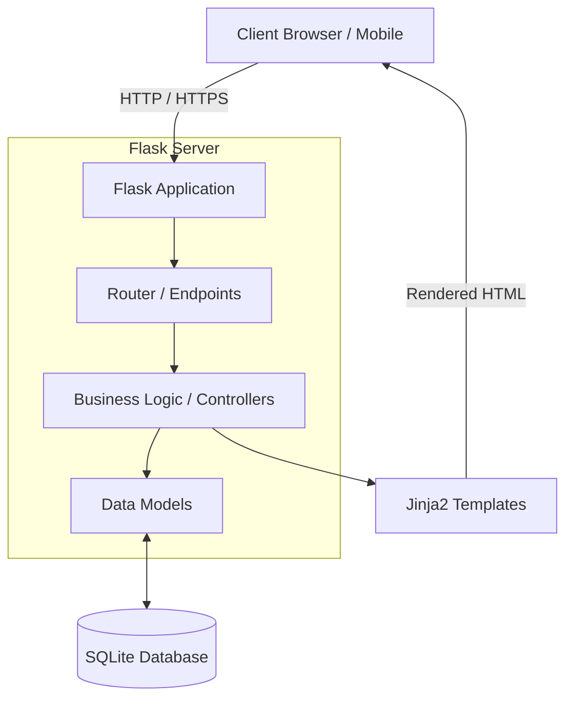
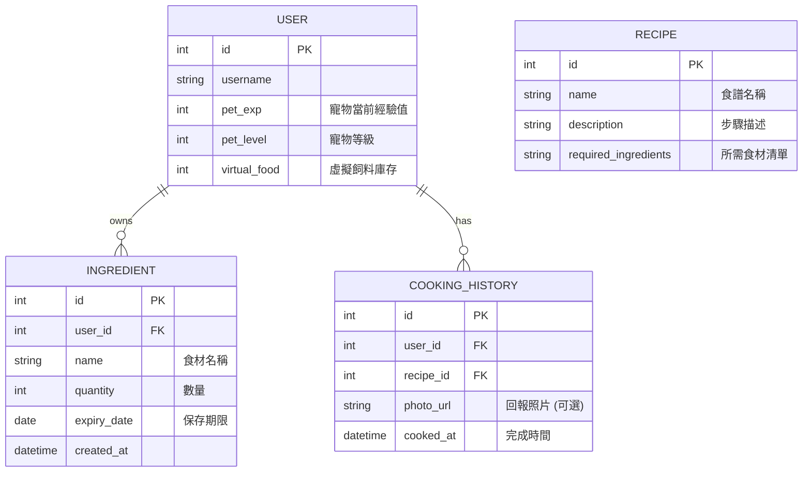
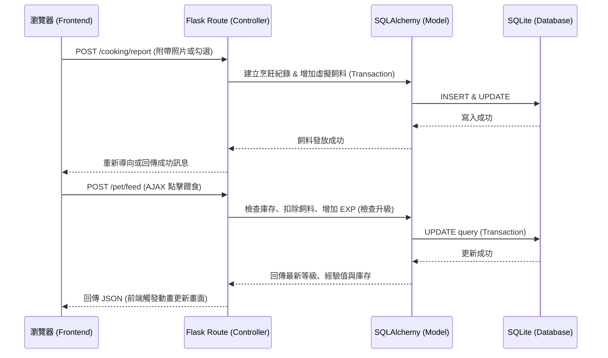

# 隨食隨地 - 系統架構文件 (Architecture)

本文件基於 `docs/PRD.md` 的需求，規劃「隨食隨地」系統的技術架構、資料庫設計與核心模組運作流程。

## 1. 系統架構概述

本專案採用**單體式架構 (Monolithic Architecture)** 與 **MVC (Model-View-Controller) 設計模式**，以傳統的後端渲染 (Server-Side Rendering, SSR) 為主，搭配少量的 Vanilla JavaScript 處理動態互動，以符合 MVP 階段快速開發的需求。

### 選用技術與原因
- **後端：Python + Flask**
  - **原因**：輕量級的 Python Web 框架，靈活度高，能快速建立 API 與路由，並且有豐富的套件生態系可供後續擴充 (例如進階的 AI 圖像辨識)。
- **模板引擎：Jinja2**
  - **原因**：內建於 Flask，能夠將後端傳遞的資料（如食材庫存、寵物經驗值）動態渲染成 HTML 頁面。
- **資料庫：SQLite + SQLAlchemy**
  - **原因**：SQLite 無需額外設定伺服器，非常適合開發初期。透過 SQLAlchemy (ORM) 可直覺地操作資料庫表，降低 SQL 語法錯誤風險並防止 SQL Injection。
- **前端：HTML / CSS / Vanilla JavaScript**
  - **原因**：使用原生 JS 處理輕量級的互動（如點擊餵食按鈕、進度條動畫、圖片上傳預覽），不引入龐大的前端框架，降低開發與維護成本。

### 系統元件圖

---

## 2. 核心模組與路由設計

根據 PRD 的核心功能 (F-01 ~ F-05)，系統劃分為以下主要模組：

### 2.1 食材管理模組 (F-01, F-03)
負責「我的材料庫」的增刪改查與過期追蹤。
- `GET /inventory`：取得使用者的食材列表。
- `POST /inventory/add`：新增食材（手動輸入）。
- `POST /inventory/update/<id>`：修改食材數量。
- `POST /inventory/delete/<id>`：刪除食材。

### 2.2 食譜推薦模組 (F-02)
根據現有庫存進行食譜比對與推薦。
- `GET /recipes/recommend`：根據使用者的食材清單，回傳符合或部分符合的食譜推薦列表。
- `GET /recipes/<id>`：檢視單一食譜詳細步驟。

### 2.3 寵物養成與遊戲化模組 (F-04, F-05)
處理烹飪回報與寵物經驗值計算。
- `GET /pet`：取得寵物當前狀態（等級、經驗值、動畫狀態）。
- `POST /pet/feed`：消耗完成料理後獲得的「虛擬飼料」，增加寵物經驗值 (AJAX)。
- `POST /cooking/report`：使用者回報完成料理，系統發放飼料獎勵並記錄烹飪歷史。

---

## 3. 資料庫設計 (Database Schema)

以下為支援核心功能的關聯式資料庫架構 (Entity-Relationship Diagram)。

---

## 4. 系統互動流程

以「餵食寵物」與「烹飪回報」為例的系統資料流動：

---

## 5. 關鍵設計決策

1. **一體化的後端渲染 (Monolithic SSR) 而非前後端分離**
   - **原因**：團隊需在有限時間內完成 MVP 開發，使用 Flask + Jinja2 可減少 API 設計成本與跨域 (CORS) 問題，開發速度最快。互動性較強的「餵食動畫」可透過簡單的 AJAX 呼叫與 JavaScript 來補足。

2. **使用 Transaction (交易機制) 保證資料一致性**
   - **原因**：在「餵食」或「烹飪回報」的過程中，會同時發生「扣除飼料」與「增加寵物經驗值」等動作。這類操作必須綁定在同一個 Transaction 中，若其中一個失敗則全部 Rollback，避免資料不一致。

3. **使用者上傳圖片儲存於本地端 (`static/uploads`)**
   - **原因**：考量初期為 MVP 階段，暫不引入外部雲端儲存 (如 AWS S3) 以降低複雜度與成本。直接將圖片存在伺服器本地的靜態資料夾中，並在資料庫儲存「檔案路徑」。

4. **餵食行為採 AJAX 異步請求**
   - **原因**：點擊「餵食」如果讓整頁重新整理，會中斷使用者的沉浸感與動畫體驗。前端透過 Fetch API 呼叫後端路由，後端回傳 JSON（新的 EXP 與庫存），前端再用 JavaScript 更新畫面與播放進度條動畫。
