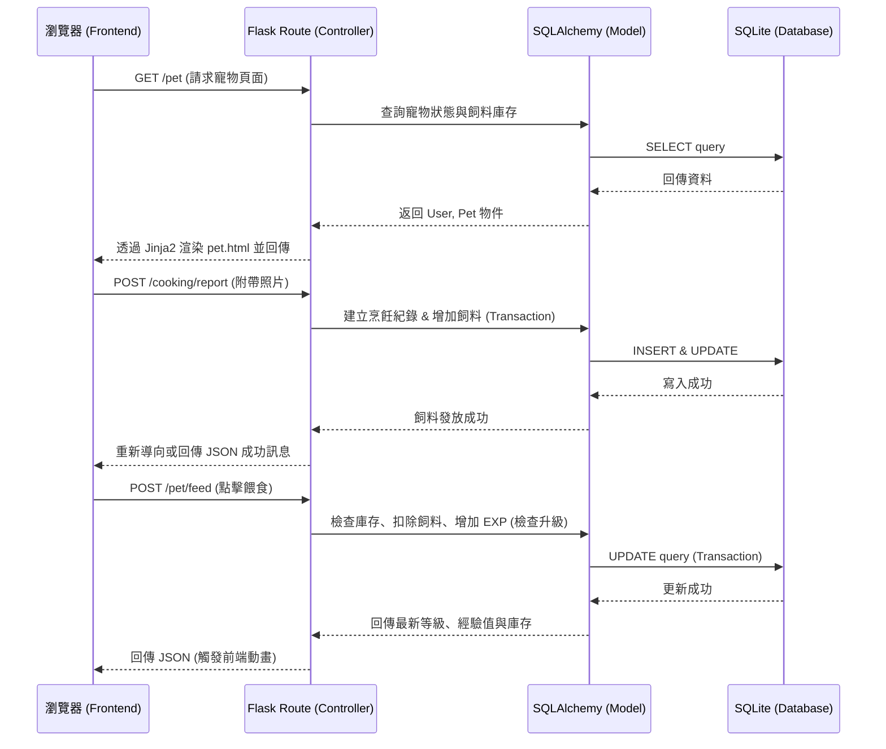

# 隨食隨地 - 系統架構文件 (Architecture)

## 1. 技術架構說明

本專案「隨食隨地」採用傳統的後端渲染 (Server-Side Rendering, SSR) 架構，不進行前後端分離。透過這個架構，我們能快速開發出包含烹飪回報 (F-04) 與虛擬寵物養成 (F-03) 等核心功能的 MVP 產品。

### 選用技術與原因
- **後端：Python + Flask**
  - **原因**：Flask 是輕量級的 Python Web 框架，適合小型至中型專案。它靈活度高，能快速建立 API 與路由，並且有豐富的套件生態系可供後續擴展（例如未來可加入 AI 圖像辨識）。
- **模板引擎：Jinja2**
  - **原因**：內建於 Flask 中，能夠將後端傳遞的資料（如寵物經驗值、飼料數量）動態渲染成 HTML 頁面。
- **資料庫：SQLite + SQLAlchemy**
  - **原因**：SQLite 是輕量級的關聯式資料庫，不需要額外設定資料庫伺服器，非常適合開發初期。透過 SQLAlchemy (ORM)，能用 Python 程式碼直覺地操作資料庫表（如使用者表、飼料庫存表、寵物狀態表），降低 SQL 語法錯誤風險。
- **前端：HTML / CSS / Vanilla JavaScript**
  - **原因**：配合 Jinja2 進行頁面渲染，使用原生 JS 處理輕量級的互動（如點擊餵食按鈕、進度條動畫、圖片上傳預覽），不引入過度複雜的前端框架（如 React/Vue），降低開發成本。

### Flask MVC 模式說明
專案將遵循 MVC（Model-View-Controller）的設計概念：
- **Model（資料模型）**：負責與 SQLite 互動，定義資料表結構（例如 `User`, `Pet`, `CookingRecord`），並處理資料的讀寫與商業邏輯（如經驗值升級計算、飼料增減防呆）。
- **View（視圖）**：負責畫面呈現，由 Jinja2 模板（`*.html`）與靜態檔案（CSS, JS）組成。負責將 Controller 傳來的資料渲染成最終網頁。
- **Controller（控制器）**：由 Flask 的路由（Routes）擔任。負責接收使用者的 HTTP 請求（例如回報烹飪完成、點擊餵食），呼叫對應的 Model 處理資料，並將結果傳遞給 View 進行渲染或回傳 JSON。

---

## 2. 專案資料夾結構

建議採用模組化的結構，將不同職責的檔案分開，便於維護與團隊協作。

```text
goodjob/
│
├── app/                        # 應用程式主要邏輯
│   ├── __init__.py             # 初始化 Flask App 與載入設定
│   ├── models/                 # 資料庫模型 (Model)
│   │   ├── __init__.py
│   │   ├── user.py             # 使用者與飼料庫存資料表
│   │   └── pet.py              # 虛擬寵物狀態資料表
│   │
│   ├── routes/                 # Flask 路由控制器 (Controller)
│   │   ├── __init__.py
│   │   ├── cooking.py          # 烹飪回報相關路由 (F-04)
│   │   └── pet.py              # 寵物養成與餵食相關路由 (F-03)
│   │
│   ├── templates/              # Jinja2 HTML 模板 (View)
│   │   ├── base.html           # 共用網頁佈局
│   │   ├── index.html          # 首頁
│   │   ├── pet.html            # 寵物養成與餵食頁面
│   │   └── cooking.html        # 烹飪回報與照片上傳頁面
│   │
│   └── static/                 # 靜態資源檔案
│       ├── css/                # 樣式表 (style.css)
│       ├── js/                 # 前端互動邏輯 (main.js, 動畫處理)
│       └── uploads/            # 存放使用者上傳的料理照片
│
├── instance/                   # 存放運行時產生的檔案
│   └── database.db             # SQLite 資料庫檔案
│
├── docs/                       # 專案文件 (PRD, 架構圖等)
│
├── app.py                      # 應用程式執行入口
├── requirements.txt            # Python 套件相依清單
└── README.md                   # 專案說明文件
```

---

## 3. 元件關係圖

以下是系統核心運作流程的關係圖，說明瀏覽器、Flask Controller、Model 與資料庫間的互動：



---

## 4. 關鍵設計決策

1. **一體化的後端渲染 (Monolithic SSR) 而非前後端分離**
   - **原因**：團隊需在有限時間內完成開發，使用 Flask + Jinja2 可減少 API 設計成本與跨域 (CORS) 問題，開發速度最快。互動性較強的「餵食動畫」可透過簡單的 AJAX 呼叫與 JavaScript 來補足。

2. **使用 Transaction (交易機制) 保證資料一致性**
   - **原因**：在「餵食」的過程中，會同時發生「扣除飼料庫存」與「增加寵物經驗值」兩個動作。這兩個操作必須綁定在同一個 Transaction 中，若其中一個失敗，另一個會 Rollback，避免出現飼料被扣除但寵物沒加經驗值的 Bug。

3. **使用者上傳圖片儲存於本地端 (`static/uploads`)**
   - **原因**：考量初期為 MVP 階段，暫不引入外部雲端儲存 (如 AWS S3) 以降低複雜度與成本。直接將圖片存在伺服器本地的靜態資料夾中，並在資料庫僅儲存「檔案路徑」，既能輕鬆透過網址存取圖片，又能減輕資料庫負擔。

4. **餵食行為採 AJAX 異步請求**
   - **原因**：點擊「餵食」如果讓整頁重新整理，會中斷使用者的沉浸感與動畫體驗。因此前端會透過 Fetch API (或 XMLHttpRequest) 呼叫後端路由，後端只回傳 JSON（新的 EXP 與庫存），前端再用 JavaScript 更新畫面與播放進度條動畫。
