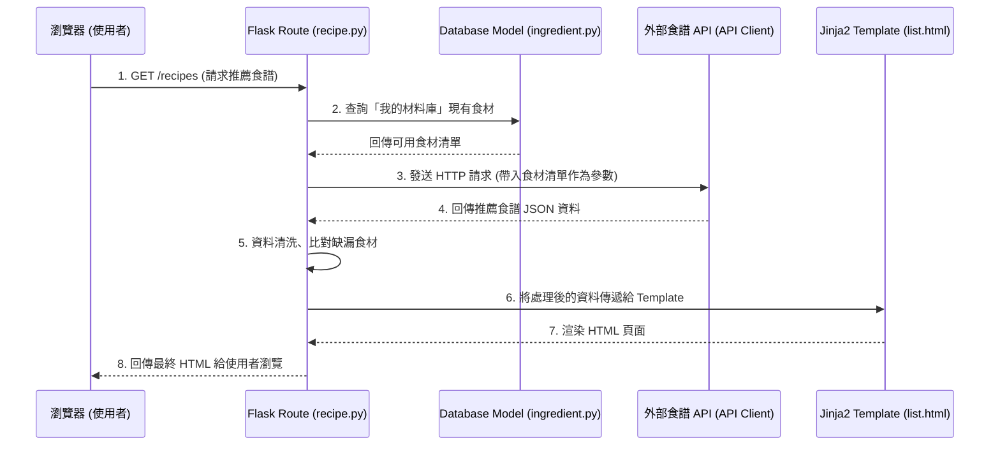

# 系統架構設計 - 智慧食譜推薦系統 (F-02)

本文件根據 `docs/PRD_F02_智慧食譜推薦系統.md` 的需求，規劃「智慧食譜推薦系統」的技術架構與資料夾結構。

## 1. 技術架構說明

本系統採用經典的 **MVC (Model-View-Controller)** 模式進行設計，並使用 Server-Side Rendering (SSR) 技術，由伺服器端直接渲染完整的網頁回傳給瀏覽器。

### 選用技術與原因
- **後端框架：Python + Flask**
  - **原因**：Flask 輕量且彈性高，適合快速開發與驗證 MVP。Python 擁有豐富的套件庫（如 `requests`），非常利於進行外部 API 的串接與資料處理。
- **頁面渲染（View）：Jinja2 模板引擎**
  - **原因**：與 Flask 深度整合，無需額外架設前端伺服器。可用直覺的語法將後端傳來的食譜資料動態渲染成 HTML。
- **資料庫（Model）：SQLite**
  - **原因**：設定極為簡單，無需建置獨立資料庫伺服器，適合本專案中用於儲存「我的材料庫」等資料。

### Flask MVC 模式說明
- **Model (資料模型)**：負責與 SQLite 互動，處理「我的材料庫」中食材的讀取與更新。
- **View (視圖)**：Jinja2 模板，負責將資料（如推薦的食譜列表、詳細步驟）轉換為使用者可見的 HTML 頁面。
- **Controller (控制器)**：Flask 的 Route，負責接收使用者的請求、呼叫 Model 取得現有食材、呼叫外部食譜 API、並將最終資料傳遞給 View 進行渲染。

---

## 2. 專案資料夾結構

採用模組化的結構來保持專案清晰：

```text
goodjob/
│
├── app.py                # 系統入口檔案，負責初始化 Flask 應用程式
├── requirements.txt      # 記錄依賴套件 (Flask, requests 等)
│
├── app/                  # 主要應用程式邏輯
│   ├── __init__.py       # Flask app 實例化與註冊設定
│   ├── config.py         # 系統設定檔（包含外部 API Key 等）
│   │
│   ├── models/           # (Model) 資料庫模型
│   │   ├── __init__.py
│   │   └── ingredient.py # 處理「我的材料庫」的資料邏輯
│   │
│   ├── routes/           # (Controller) Flask 路由與 API 串接邏輯
│   │   ├── __init__.py
│   │   ├── recipe.py     # 食譜推薦相關路由 (列表、詳細頁面)
│   │   └── api_client.py # 封裝與外部食譜 API 溝通的邏輯
│   │
│   ├── templates/        # (View) Jinja2 HTML 模板
│   │   ├── base.html     # 共用版型（包含 Navigation, Header）
│   │   └── recipe/
│   │       ├── list.html   # 推薦食譜列表頁
│   │       └── detail.html # 單一食譜詳細頁面
│   │
│   └── static/           # 靜態資源 (CSS, JS, 圖片)
│       ├── css/
│       │   └── style.css # 共用樣式與 Loading 動畫設定
│       └── js/
│           └── main.js   # 處理前端簡易互動 (如點擊載入中的動畫)
│
└── instance/             # 存放不需要進版控的本地資料庫
    └── database.db       # SQLite 資料庫檔案
```

---

## 3. 元件關係圖

以下展示使用者發起請求後，系統各元件的資料流動與互動關係：



---

## 4. 關鍵設計決策

1. **獨立封裝 `api_client.py` 處理外部請求**
   - **原因**：將呼叫外部食譜 API 的邏輯（如處理 Rate Limit、Error Handling、JSON 解析）與 Route 路由分離，能讓 Controller 保持整潔。未來如果更換食譜 API 供應商，也只需要修改此檔案即可，降低耦合度。

2. **Server-Side Rendering (SSR) 搭配簡易前端 JS**
   - **原因**：因專案採用 Flask + Jinja2 不做前後端分離，為了彌補等待外部 API 回應時的「畫面卡頓感」，將在前端加入少量的 Vanilla JS 顯示 Loading 動畫，點擊按鈕時立刻給予視覺回饋，兼顧開發速度與使用者體驗。

3. **不在本地端儲存大量食譜，僅存儲使用者庫存**
   - **原因**：本系統核心價值在於「現有食材應用」，而非建立一個龐大的食譜資料庫。因此食譜內容皆為「即時查詢即時顯示」，SQLite 資料庫僅專注於管理使用者的個人「材料庫」庫存，減輕伺服器儲存負擔。

4. **分離 Configuration 檔案 (`config.py`)**
   - **原因**：外部食譜 API 通常需要 API Key 等敏感資訊。將設定獨立於 `config.py` 並搭配環境變數 (.env) 管理，可避免將 API Key 直接暴露在 Git 紀錄中，確保系統安全性。
