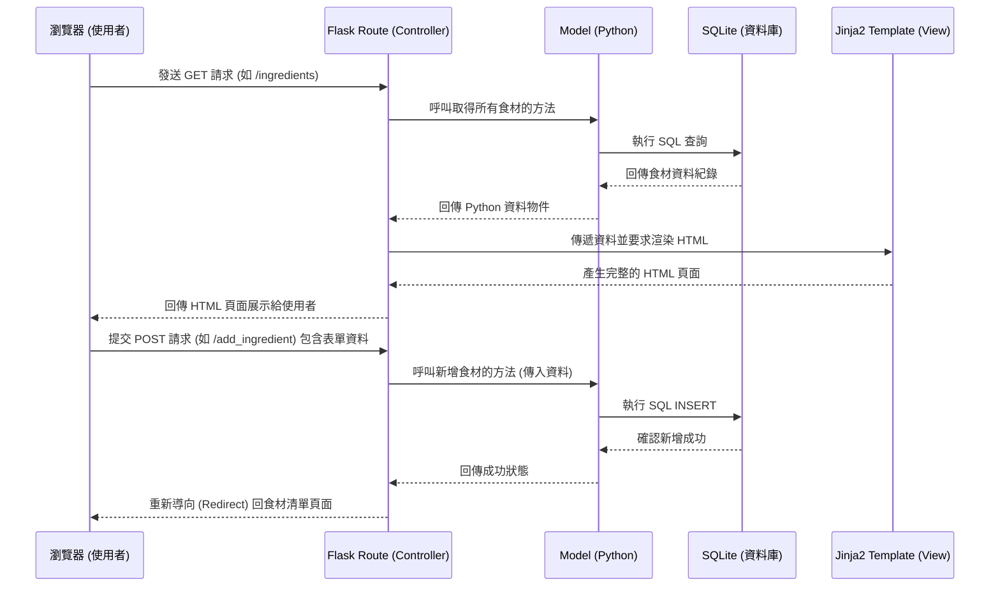

# 系統架構文件 (Architecture) - 隨食隨地

## 1. 技術架構說明

本專案採用經典的伺服器端渲染 (Server-Side Rendering) 架構，適合快速驗證核心點子並降低初期開發與維護的複雜度。

### 選用技術與原因
- **後端框架：Python + Flask**
  - **原因**：Flask 是輕量級的 Python Web 框架，學習曲線平緩，非常適合建置初期的 MVP (Minimum Viable Product)。
- **模板引擎：Jinja2**
  - **原因**：與 Flask 高度整合，能夠直接在伺服器端將資料庫查詢結果渲染為 HTML，不需處理複雜的前後端 API 串接。
- **資料庫：SQLite**
  - **原因**：不需要額外架設資料庫伺服器，資料儲存為一個本地檔案，非常適合初期開發、測試與輕量級應用。

### Flask MVC 模式說明
專案邏輯將依循 MVC (Model-View-Controller) 架構模式進行分離：
- **Model (模型)**：負責定義資料結構與操作資料庫 (SQLite)。包含食材庫存、使用者、食譜等實體的資料存取邏輯。
- **View (視圖)**：負責呈現使用者介面。在這裡指的是 Jinja2 模板 (HTML)，接收從 Controller 傳來的資料並呈現給使用者。
- **Controller (控制器)**：由 Flask 的路由 (Routes) 擔任。負責接收瀏覽器的請求 (Requests)，調用適當的 Model 處理資料，最後將資料傳遞給 View 進行渲染。

## 2. 專案資料夾結構

以下是專案預期的資料夾樹狀圖與各部分用途說明：

```text
goodjob/
│
├── app/                  # 應用程式主要邏輯
│   ├── models/           # 放置資料庫模型定義與資料庫操作邏輯
│   │   └── ingredient.py # 食材的 Model (對應 F-01 功能)
│   ├── routes/           # 放置 Flask 路由定義 (Controllers)
│   │   └── main.py       # 主要頁面路由
│   ├── templates/        # 放置 Jinja2 HTML 模板 (Views)
│   │   ├── base.html     # 共用頁面版型 (Header, Footer)
│   │   └── index.html    # 首頁 / 我的材料庫清單 (對應 F-01 功能)
│   └── static/           # 放置靜態資源
│       ├── css/          # 樣式表 (style.css)
│       └── js/           # 客製化 JavaScript 腳本
│
├── instance/             # 放置運行時產生的檔案 (不應被 Git 追蹤)
│   └── database.db       # SQLite 資料庫檔案
│
├── docs/                 # 放置專案文件 (如 PRD, 架構圖等)
│   ├── PRD.md            # 產品需求文件
│   └── ARCHITECTURE.md   # 系統架構文件 (本文件)
│
├── app.py                # Flask 專案主程式入口，負責啟動伺服器
└── requirements.txt      # 記錄 Python 依賴套件清單
```

## 3. 元件關係圖

以下圖表展示了系統中不同元件如何協同運作處理使用者的請求：



## 4. 關鍵設計決策

1. **優先落實 F-01 (食材輸入與管理) 基礎建設**：
   - 作為整個系統的核心，食材庫存 (`ingredient`) 將是首要建立的 Model。所有後續的食譜推薦 (F-02) 或過期提醒 (F-03) 都高度依賴這個資料表的準確性。
2. **採用 Server-Side Rendering (SSR) 不做前後端分離**：
   - 為了加快開發速度並符合團隊目前技術能力，統一由 Flask 後端渲染 HTML。針對未來的 F-04 寵物養成微互動，僅在必要時於 `static/js/` 撰寫輕量的 JavaScript 來提升體驗，避免引入大型前端框架。
3. **SQLite 作為唯一資料來源**：
   - 在 MVP 階段，資料庫效能不會是瓶頸。SQLite 將資料存在專案目錄下 (`instance/database.db`)，極大地降低了環境建置與部署難度，讓團隊可以專注在功能驗證。
4. **模組化的目錄結構**：
   - 雖然初期功能不多，但預先規劃 `app/routes/` 與 `app/models/` 的結構，能避免將所有程式碼塞入單一的 `app.py` 中，確保日後系統擴充時仍能保持良好的維護性。
