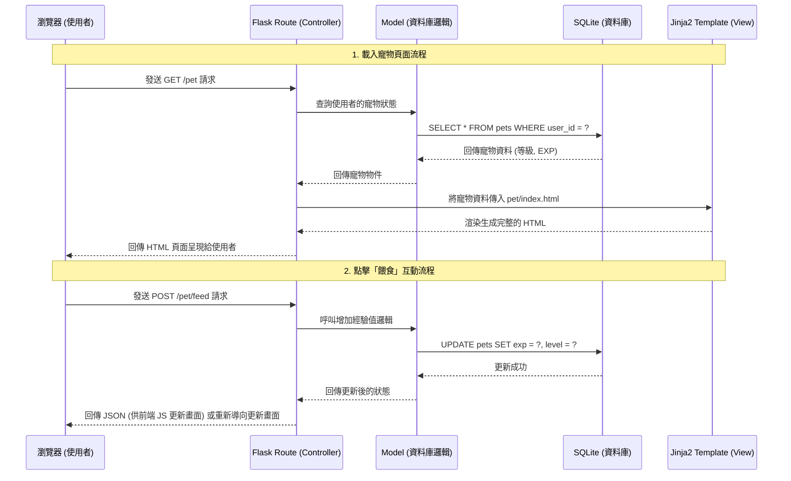

# 系統架構設計 - 隨食隨地 (虛擬寵物養成系統 F-03)

## 1. 技術架構說明

為了快速開發且符合「隨食隨地」專案中「虛擬寵物養成系統 (F-03)」的需求，我們採用了經典的伺服器端渲染（Server-Side Rendering, SSR）架構。

### 選用技術與原因
- **後端框架：Python + Flask**
  - 原因：Flask 輕量、彈性高，非常適合用於快速建立原型與中小型網頁應用程式，能讓我們專注於核心的寵物經驗值計算與狀態管理邏輯。
- **模板引擎：Jinja2**
  - 原因：Flask 內建的模板引擎，允許我們直接在 HTML 中嵌入 Python 變數與邏輯（例如：動態渲染經驗值進度條），不需要前後端分離，降低開發複雜度。
- **資料庫：SQLite**
  - 原因：輕量級關聯式資料庫，不需要額外安裝與設定資料庫伺服器，資料會儲存在本地檔案中，非常適合初學者與概念驗證（MVP）階段。

### Flask MVC 模式說明
雖然 Flask 本身不強制要求 MVC（Model-View-Controller）架構，但為了讓程式碼好維護，我們將專案結構劃分為以下三個職責：
- **Model（模型）**：負責與 SQLite 資料庫溝通，處理「虛擬寵物」與「使用者」的資料結構與商業邏輯（如：更新經驗值、升級判斷）。
- **View（視圖）**：負責呈現畫面給使用者看。在這裡就是由 **Jinja2 HTML 模板** 與 CSS/JS 構成，負責顯示寵物圖片、進度條與介面。
- **Controller（控制器）**：負責接收使用者的請求並進行處理。在這裡就是 **Flask 的路由（Routes）**，例如接收到「點擊餵食」的請求後，呼叫 Model 增加經驗值，然後把新資料傳給 View 渲染出更新後的畫面。

---

## 2. 專案資料夾結構

以下為本專案的資料夾結構與各檔案的用途說明：

```text
goodjob/
│
├── app/                        # 應用程式的主要目錄
│   ├── __init__.py             # 初始化 Flask 應用程式與設定
│   ├── database.py             # 負責與 SQLite 資料庫連線的設定
│   │
│   ├── models/                 # [Model] 資料庫模型
│   │   ├── user.py             # 使用者模型（管理使用者資訊）
│   │   └── pet.py              # 寵物模型（管理寵物等級、經驗值等邏輯）
│   │
│   ├── routes/                 # [Controller] Flask 路由
│   │   └── pet_routes.py       # 處理與寵物相關的請求（如：顯示寵物頁面、餵食 API）
│   │
│   ├── templates/              # [View] Jinja2 HTML 模板
│   │   ├── base.html           # 共用的 HTML 骨架（包含導覽列等）
│   │   └── pet/
│   │       └── index.html      # 寵物專屬展示頁面（包含進度條與互動按鈕）
│   │
│   └── static/                 # 靜態資源檔案
│       ├── css/
│       │   └── style.css       # 全站與進度條的樣式設計
│       ├── js/
│       │   └── pet.js          # 處理前端互動（如：餵食按鈕的非同步請求、動畫）
│       └── images/             # 存放寵物各階段的外觀圖片
│
├── instance/                   # 存放專案執行時產生的實體檔案
│   └── database.db             # SQLite 資料庫檔案
│
├── database/                   # 資料庫初始化相關
│   └── schema.sql              # 定義資料表結構的 SQL 語法
│
├── docs/                       # 專案說明文件
│   ├── PRD_F03_虛擬寵物養成系統.md
│   └── ARCHITECTURE.md         # 本系統架構文件
│
├── app.py                      # 專案執行入口（啟動 Flask 伺服器）
└── requirements.txt            # 紀錄專案所需安裝的 Python 套件
```

---

## 3. 元件關係圖

以下展示使用者如何透過瀏覽器與我們的系統進行互動的流程：



---

## 4. 關鍵設計決策

1. **不採用前後端分離架構**
   - **原因**：為了在有限的時間與資源下快速驗證「虛擬寵物養成系統」的想法，使用 Flask + Jinja2 可以讓開發團隊在同一個專案中同時處理前後端邏輯，省去跨網域請求 (CORS) 與 API 串接的複雜度。

2. **使用 AJAX (JavaScript) 處理餵食互動**
   - **原因**：雖然採用伺服器端渲染，但為了讓使用者在點擊「餵食」時獲得流暢的遊戲體驗，餵食按鈕的觸發會透過前端 JavaScript 發送非同步請求 (AJAX/Fetch API)。這樣就不需要重新載入整個頁面，可以即時更新進度條與呈現微動畫。

3. **統一的資料庫存取層 (models/)**
   - **原因**：將所有與資料庫溝通的 SQL 語法與邏輯集中在 `models/` 資料夾中，而不是直接寫在路由 (`routes/`) 裡。這樣做的好處是當未來邏輯變複雜（例如加入更多升級條件）時，程式碼更容易維護與測試。

4. **採用 SQLite 作為 MVP 階段的資料庫**
   - **原因**：寵物養成系統目前的資料結構相對單純（使用者、寵物狀態）。SQLite 是一個檔案型資料庫，不需要架設伺服器即可運作，能讓團隊成員拉下程式碼後無痛啟動專案，非常適合目前的開發階段。
