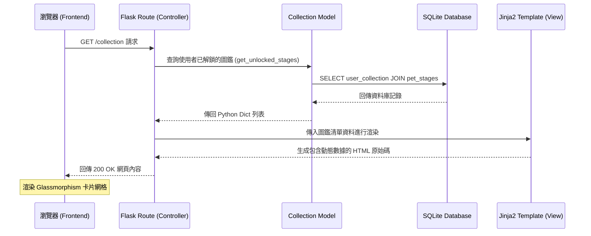
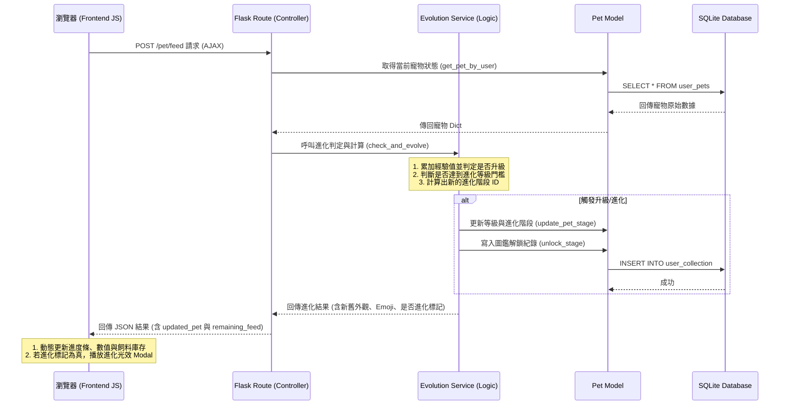

# 隨「食」隨地 — 系統架構文件 (System Architecture)

本文件詳細規劃並描述「隨「食」隨地」系統（特別是針對 F-06 寵物進化圖鑑功能與 F-04 烹飪回報）的軟體架構、目錄結構、元件職責與關鍵設計決策。

---

## 1. 技術架構說明

本系統採用經典的 **MVC (Model-View-Controller)** 設計模式，配合服務層（Service Layer）來處理複雜的業務邏輯。此架構能有效解耦資料、呈現與控制邏輯，提升系統的擴充性與可維護性。

### 1.1 技術選型與原因

*   **後端框架：Python + Flask**
    *   *選用原因*：Flask 是一款輕量級且高度靈活的微型框架（Micro-framework），非常適合 MVP 階段快速開發與迭代，且能輕易融入模組化設計。
*   **前端渲染：Jinja2 模板引擎**
    *   *選用原因*：Jinja2 是 Flask 預設的模板引擎，支持在 HTML 中動態插入後端數據與渲染邏輯。採用「伺服器端渲染 (SSR)」免去了維護繁雜的前後端分離專案的成本，極適合小規模協作與快速成型。
*   **資料庫與 ORM 雙重架構：SQLite + SQLAlchemy & Raw sqlite3**
    *   *選用原因*：為了兼顧開發效率與底層控制力，系統採用了兩種存取機制。
        *   **SQLAlchemy ORM**：用於使用者權限、成就系統、飲食偏好（F-02, F-03）等業務，利用其 ORM 關係映射與交易機制（Transaction）快速建模。
        *   **Raw SQLite 連線**：用於食材庫存（F-01）與寵物養成/進化圖鑑（F-03, F-06），利用 SQL 原生寫法進行高度靈活的 JOIN 查詢與輕量化資料處理。
        *   兩者均連接至同一個本地資料庫 `instance/database.db`，確保資料的單一真實來源。
*   **前端邏輯：HTML5 + CSS3 + JavaScript (Vanilla JS)**
    *   *選用原因*：不依賴大型前端框架（如 React/Vue），使用原生 CSS 與 JavaScript 實作 Glassmorphism（毛玻璃效果）的 UI 風格與進化動畫，降低系統複雜度並提高載入效能。

### 1.2 Flask MVC 模式說明

*   **Model (資料模型層)**：
    *   位於 `app/models/`，負責直接存取 SQLite 資料庫，定義資料表存取邏輯（如 `Ingredient`、`Pet`、`Collection`、`FeedInventory`、`CookingRecord` 的 CRUD 運作），並封裝資料校驗與變更邏輯。
*   **View (視圖呈現層)**：
    *   位於 `app/templates/` 與 `app/static/`，使用 HTML5/Jinja2 模板與 CSS 決定使用者的視覺界面，配合 JavaScript 處理前端互動與動畫（如圖鑑卡片翻面、進化光效、圖片上傳預覽）。
*   **Controller (控制器/路由層)**：
    *   位於 `app/routes/`，定義系統的所有 HTTP 路由與 API端點，負責接收使用者請求、調用對應的 Model 或 Service 處理資料，最後決定要渲染哪個 Jinja2 模板或返回 JSON 數據。
*   **Service (服務層 - 額外擴充)**：
    *   位於 `app/services/`，當業務邏輯過於複雜（例如進化條件判定與經驗值跳級計算）不適合寫在 Controller 或 Model 中時，將其提取至 Service 層（如 `EvolutionService`）進行統一封裝，保持 Controller 的簡潔度。

---

## 2. 專案資料夾結構

以下為整個專案的整合目錄結構，所有主要邏輯皆集中於 `app/` 套件目錄下：

```text
goodjob/
├── app/                        # 應用程式主要套件目錄
│   ├── database.py             # 資料庫連線管理與初始化工具
│   │
│   ├── models/                 # [Model] 資料庫存取與邏輯層
│   │   ├── __init__.py
│   │   ├── ingredient.py       # 食材管理 Model (F-01)
│   │   ├── pet.py              # 寵物狀態與 CRUD Model (F-03/F-06)
│   │   ├── collection.py       # 寵物圖鑑資料 CRUD Model (F-06)
│   │   ├── feed_inventory.py   # 飼料庫存 ORM Model (F-04)
│   │   └── cooking_record.py   # 烹飪紀錄 ORM Model (F-04)
│   │
│   ├── routes/                 # [Controller] 路由與 API 端點
│   │   ├── __init__.py
│   │   ├── ingredient.py       # 食材管理路由 (F-01)
│   │   ├── recipe.py           # 食譜推薦路由 (F-02)
│   │   ├── pet_routes.py       # 虛擬寵物養成路由 (F-03/F-04/F-06)
│   │   ├── collection_routes.py# 寵物圖鑑與進化 API 路由 (F-06)
│   │   └── cooking.py          # 烹飪回報與飼料發放路由 (F-04)
│   │
│   ├── services/               # [Service] 核心業務邏輯服務層
│   │   └── evolution_service.py# 寵物經驗值計算與進化引擎 (F-06)
│   │
│   ├── templates/              # [View] Jinja2 HTML 模板
│   │   ├── base.html           # 全站統一的 Glassmorphism 共用版型
│   │   ├── ingredients/
│   │   │   ├── index.html      # 我的材料庫首頁 (F-01)
│   │   │   └── edit.html       # 食材編輯頁面 (F-01)
│   │   ├── recipes/
│   │   │   └── recommend.html  # 食譜推薦展示頁 (F-02)
│   │   ├── pet/
│   │   │   └── index.html      # 虛擬寵物互動頁面 (F-03/F-04)
│   │   ├── collection/
│   │   │   ├── index.html      # 寵物圖鑑展示頁面 (F-06)
│   │   │   └── detail.html     # 寵物階段詳情頁面 (F-06)
│   │   ├── cooking/
│   │   │   └── index.html      # 烹飪照片回報與進度表單頁面 (F-04)
│   │   └── components/
│   │       └── evolution_modal.html # 進化動畫彈窗組件
│   │
│   └── static/                 # 靜態資源 (CSS, JS, 圖片)
│       ├── css/
│       │   ├── style.css       # 共用樣式表
│       │   └── collection.css  # 圖鑑專屬樣式表
│       ├── js/
│       │   └── collection.js   # 圖鑑與進化互動 JS 腳本
│       ├── images/
│       │   └── pets/           # 儲存寵物進化各階段的圖片
│       └── uploads/            # 儲存使用者上傳的料理圖片 (F-04)
│
├── sql_models.py               # 共享的 SQLAlchemy ORM 結構 (User, Preferences, Achievements 等)
│
├── database/
│   └── schema.sql              # 統一 SQLite 建表語法與種子資料
│
├── instance/
│   └── database.db             # 運行時生成的 SQLite 資料庫檔案
│
├── docs/                       # 系統說明文件
│   ├── PRD.md                  # 專案需求文件
│   ├── ARCHITECTURE.md         # 本系統架構文件
│   ├── DB_DESIGN.md            # 資料庫設計文件
│   ├── FLOWCHART.md            # 使用者與系統流程圖
│   └── ROUTES.md               # 路由與 API 設計文件
│
├── app.py                      # Flask 專案唯一啟動入口
├── config.py                   # 專案全局設定檔
├── init_db.py                  # 資料庫初始化腳本
└── requirements.txt            # Python 套件依賴清單
```

---

## 3. 元件關係與資料流向

以下展示使用者在瀏覽器操作系統時，前後端與資料庫的關鍵資料流向：

### 3.1 頁面渲染資料流 (SSR)
當使用者要求瀏覽圖鑑頁面時：



### 3.2 異步 API 資料流 (AJAX)
當使用者在寵物養成頁面點擊「手動餵食」觸發經驗值變更並判定進化時：



---

## 4. 關鍵設計決策

1.  **模組化 Package 架構 (`app/` 目錄)**
    *   *原因*：相較於將所有代碼塞在單一 `app.py` 中，將專案預先進行模組化規劃（分為 `models`、`routes`、`templates` 等）能有效防止程式碼隨功能增加而失控，確保食材管理、食譜推薦、虛擬寵物與圖鑑系統能各自獨立開發、測試，不互相干擾。
2.  **核心邏輯抽離至服務層 (Service Layer)**
    *   *原因*：寵物進化判定與經驗值（EXP）跳級更新屬於複雜的業務邏輯，將其獨立封裝於 `app/services/evolution_service.py` 中。這能讓控制器（Routes）保持簡潔，僅負責處理請求與響應，且服務層邏輯可以被不同的 Route（如餵食、烹飪完成、日常登入等）重複調用，提高程式碼重用性。
3.  **無 ORM 的輕量化資料庫存取層與 ORM 的混合設計**
    *   *原因*：為了在 MVP 階段維持高效，寵物進化與食材庫存採用 Python 原生 `sqlite3` 與原生 SQL。這在處理 JOIN 複雜查詢時保留了極高的靈活性，並透過 Row Factory 提供 Dict 格式與 Jinja2 對接。同時，使用者帳號與成就則透過 `SQLAlchemy` ORM 管理，便於使用其豐富的驗證、自動更新與 Transaction 機制。
4.  **連線生命週期管理 (Request-Scoped Connection)**
    *   *原因*：在 `app/database.py` 中使用 Flask 的 `g` 全局變數管理資料庫連線，並利用 `teardown_appcontext` 在每次 HTTP 請求結束時自動關閉連線。這能確保資料庫連線不洩漏，有效防範併發寫入時可能引發的 SQLite `database is locked` 異常。
5.  **前台非同步互動 (AJAX + JSON)**
    *   *原因*：傳統 SSR 在每次使用者餵食寵物時都需要重新載入整個頁面，會造成糟糕的遊戲體驗。透過前台發送 AJAX 請求，後端返回輕量的 JSON 格式數據，前台 JavaScript 接收後進行局部 UI 更新（如進度條增加、文字變更、進化 Modal 彈出、飼料扣減），在保持 SSR 開發便利的同時，獲得極佳的 SPA（單頁應用）流暢互動感。
6. **上傳圖片儲存於本地端 (`static/uploads`)**
    *   *原因*：考量初期為 MVP 階段，暫不引入外部雲端儲存 (如 AWS S3) 以降低複雜度與成本。直接將圖片存在伺服器本地的靜態資料夾中，並在資料庫僅儲存「檔案路徑」，既能輕鬆透過網址存取圖片，又能減輕資料庫負擔。
