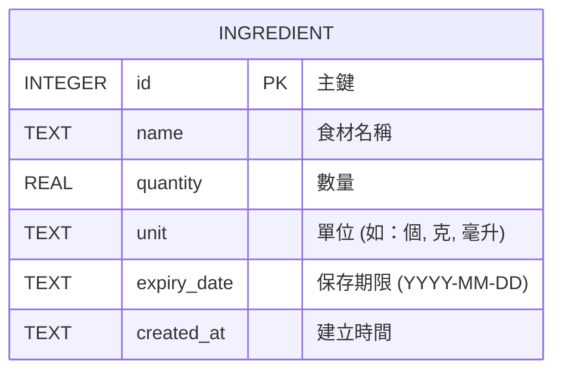

# 資料庫設計文件 (DB Design) - 隨食隨地

本文件詳細說明了隨食隨地專案的資料庫設計，包含實體關係圖 (ER 圖)、資料表說明，以及用於建表的 SQL 語法與 Python Model 對應。在 MVP 階段，核心聚焦於「食材」的增刪改查。

## 1. ER 圖（實體關係圖）

目前 MVP 的核心實體為「食材 (Ingredient)」。未來可以擴充使用者 (User)、食譜 (Recipe) 甚至虛擬寵物 (Pet) 等實體。

## 2. 資料表詳細說明

### `ingredients` (食材庫存表)
記錄使用者目前擁有的所有食材資訊。

| 欄位名稱 | 型別 | 必填 | 說明 |
| :--- | :--- | :--- | :--- |
| `id` | INTEGER | 是 | Primary Key，自動遞增。唯一識別每筆食材紀錄。 |
| `name` | TEXT | 是 | 食材名稱，例如「高麗菜」、「雞胸肉」。 |
| `quantity` | REAL | 是 | 食材的數量。使用 REAL 支援小數（如 0.5 顆）。 |
| `unit` | TEXT | 否 | 食材的單位，例如「顆」、「克」、「毫升」。方便呈現與辨識。 |
| `expiry_date` | TEXT | 否 | 食材的保存期限。建議使用 ISO 8601 日期格式字串 `YYYY-MM-DD` 儲存，方便排序與過期提醒。 |
| `created_at` | TEXT | 是 | 記錄此筆食材新增到系統中的時間戳記，以 ISO 格式儲存。 |

## 3. SQL 建表語法

請參考專案中的 `database/schema.sql`。

## 4. Python Model 程式碼

我們採用 Python 內建的 `sqlite3` 模組來實作資料庫連線與操作，以保持架構輕量。
對應的 CRUD 方法已經實作於 `app/models/ingredient.py` 中。
