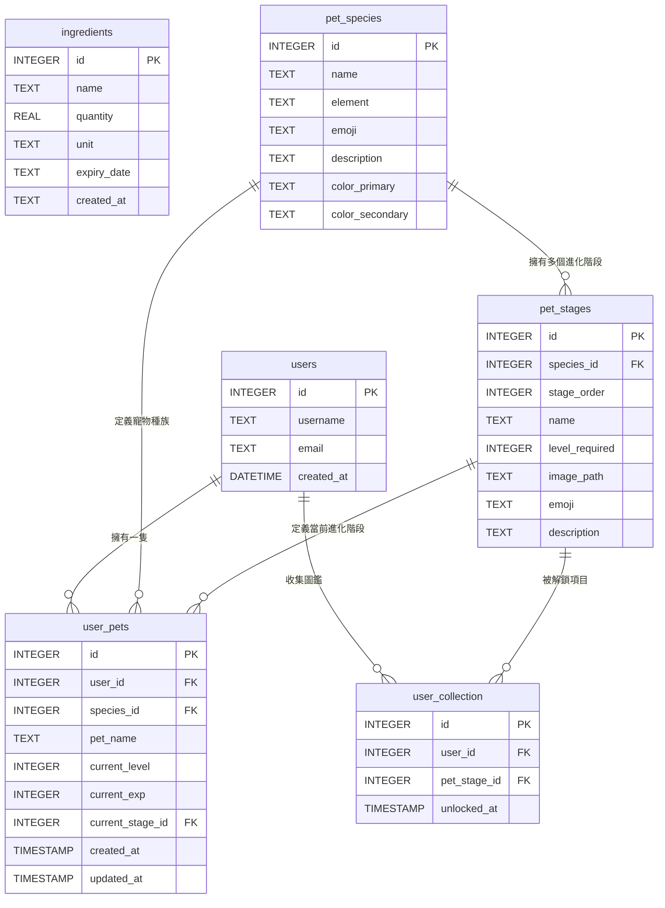

# 隨「食」隨地 — 資料庫設計文件 (Database Design)

本文件詳細說明隨「食」隨地系統所使用的 SQLite 資料庫實體關係圖 (ER 圖)、各資料表的欄位定義以及關聯設計。

---

## 1. ER 圖 (Entity-Relationship Diagram)

系統中各實體（食材庫存、使用者、寵物種族、進化階段、使用者寵物、解鎖圖鑑）的關係如下：



---

## 2. 資料表欄位詳細說明

### 2.1 `ingredients` (食材庫存表 - F-01)
記錄使用者擁有的食材庫存、數量與過期時間。

| 欄位名稱 | 型別 | 必填 | 說明 |
| :--- | :--- | :--- | :--- |
| `id` | INTEGER | 是 | 主鍵，自動遞增。 |
| `name` | TEXT | 是 | 食材名稱，如「高麗菜」、「雞蛋」。 |
| `quantity` | REAL | 是 | 食材數量（支援小數，如 0.5）。 |
| `unit` | TEXT | 否 | 數量單位，如「顆」、「克」、「ml」。 |
| `expiry_date` | TEXT | 否 | 保存期限 (ISO YYYY-MM-DD)。 |
| `created_at` | TEXT | 是 | 資料新增時間。 |

---

### 2.2 `users` (使用者帳號表 - F-03/F-06)
儲存使用者的基本帳號資料。

| 欄位名稱 | 型別 | 必填 | 說明 |
| :--- | :--- | :--- | :--- |
| `id` | INTEGER | 是 | 主鍵，自動遞增。 |
| `username` | TEXT | 是 | 使用者帳號，必須唯一。 |
| `email` | TEXT | 是 | 電子信箱，必須唯一。 |
| `created_at` | DATETIME | 是 | 帳號建立時間。 |

---

### 2.3 `pet_species` (寵物種族定義表 - F-06)
定義可供選擇的寵物種族（如小食怪、焰靈龍、鮮綠兔）。

| 欄位名稱 | 型別 | 必填 | 說明 |
| :--- | :--- | :--- | :--- |
| `id` | INTEGER | 是 | 主鍵，自動遞增。 |
| `name` | TEXT | 是 | 種族名稱，必須唯一。 |
| `element` | TEXT | 是 | 屬性分類 (cooking, fire, nature)。 |
| `emoji` | TEXT | 是 | 代表 Emoji 符號。 |
| `description` | TEXT | 否 | 種族背景風味說明。 |
| `color_primary` | TEXT | 是 | 主題主要配色 (HEX)，用於網頁 UI 渲染。 |
| `color_secondary` | TEXT | 是 | 主題次要配色 (HEX)，用於網頁 UI 渲染。 |

---

### 2.4 `pet_stages` (寵物進化階段定義表 - F-06)
定義每個種族在各個等級所對應的進化型態與外觀。

| 欄位名稱 | 型別 | 必填 | 說明 |
| :--- | :--- | :--- | :--- |
| `id` | INTEGER | 是 | 主鍵，自動遞增。 |
| `species_id` | INTEGER | 是 | 外鍵，指向 `pet_species(id)`。 |
| `stage_order` | INTEGER | 是 | 進化順序 (1, 2, 3, 4)。 |
| `name` | TEXT | 是 | 進化階段型態名稱，如「食怪蛋」、「廚神大師」。 |
| `level_required`| INTEGER | 是 | 進化所需的等級門檻。 |
| `image_path` | TEXT | 是 | 寵物外觀圖片存放路徑。 |
| `emoji` | TEXT | 是 | 階段代表 Emoji (佔位與縮放用)。 |
| `description` | TEXT | 否 | 此階段型態的風味描述。 |

---

### 2.5 `user_pets` (使用者寵物狀態表 - F-03/F-06)
記錄每位使用者當前所養的寵物狀態（等級、經驗值、當前階段）。

| 欄位名稱 | 型別 | 必填 | 說明 |
| :--- | :--- | :--- | :--- |
| `id` | INTEGER | 是 | 主鍵，自動遞增。 |
| `user_id` | INTEGER | 是 | 外鍵，指向 `users(id)`，每位使用者限擁有一隻寵物。 |
| `species_id` | INTEGER | 是 | 外鍵，指向 `pet_species(id)`。 |
| `pet_name` | TEXT | 否 | 寵物暱稱。 |
| `current_level` | INTEGER | 是 | 寵物當前等級（預設 1）。 |
| `current_exp` | INTEGER | 是 | 寵物當前累積經驗值。 |
| `current_stage_id`| INTEGER | 是 | 外鍵，指向 `pet_stages(id)`，當前進化階段。 |
| `created_at` | TIMESTAMP| 是 | 寵物創立時間。 |
| `updated_at` | TIMESTAMP| 是 | 寵物狀態更新時間。 |

---

### 2.6 `user_collection` (使用者圖鑑解鎖記錄表 - F-06)
記錄使用者已解鎖的寵物進化階段，供圖鑑書隨時查閱。

| 欄位名稱 | 型別 | 必填 | 說明 |
| :--- | :--- | :--- | :--- |
| `id` | INTEGER | 是 | 主鍵，自動遞增。 |
| `user_id` | INTEGER | 是 | 外鍵，指向 `users(id)`。 |
| `pet_stage_id` | INTEGER | 是 | 外鍵，指向 `pet_stages(id)`。 |
| `unlocked_at` | TIMESTAMP| 是 | 解鎖的時間戳記。 |

---

## 3. SQL 建表語法

本專案的完整建表語法儲存於 [schema.sql](file:///c:/Users/linpi/Desktop/程式設計/goodjob/database/schema.sql)，主要建表內容如下：

```sql
-- 1. 食材庫存表 (F-01)
CREATE TABLE IF NOT EXISTS ingredients (
    id          INTEGER PRIMARY KEY AUTOINCREMENT,
    name        TEXT NOT NULL,
    quantity    REAL NOT NULL,
    unit        TEXT,
    expiry_date TEXT,
    created_at  TEXT NOT NULL
);

-- 2. 使用者基礎資料表 (F-03/F-06)
CREATE TABLE IF NOT EXISTS users (
    id         INTEGER PRIMARY KEY AUTOINCREMENT,
    username   TEXT NOT NULL UNIQUE,
    email      TEXT NOT NULL UNIQUE,
    created_at DATETIME DEFAULT CURRENT_TIMESTAMP
);

-- 3. 寵物種族定義表 (F-06)
CREATE TABLE IF NOT EXISTS pet_species (
    id              INTEGER PRIMARY KEY AUTOINCREMENT,
    name            TEXT NOT NULL UNIQUE,
    element         TEXT NOT NULL,
    emoji           TEXT NOT NULL,
    description     TEXT,
    color_primary   TEXT DEFAULT '#ff9f43',
    color_secondary TEXT DEFAULT '#ffeaa7'
);

-- 4. 寵物進化階段定義表 (F-06)
CREATE TABLE IF NOT EXISTS pet_stages (
    id             INTEGER PRIMARY KEY AUTOINCREMENT,
    species_id     INTEGER NOT NULL,
    stage_order    INTEGER NOT NULL,
    name           TEXT NOT NULL,
    level_required INTEGER NOT NULL,
    image_path     TEXT NOT NULL,
    emoji          TEXT NOT NULL,
    description    TEXT,
    FOREIGN KEY (species_id) REFERENCES pet_species(id),
    UNIQUE(species_id, stage_order)
);

-- 5. 使用者寵物狀態表 (F-03/F-06)
CREATE TABLE IF NOT EXISTS user_pets (
    id               INTEGER PRIMARY KEY AUTOINCREMENT,
    user_id          INTEGER NOT NULL,
    species_id       INTEGER NOT NULL,
    pet_name         TEXT,
    current_level    INTEGER DEFAULT 1,
    current_exp      INTEGER DEFAULT 0,
    current_stage_id INTEGER NOT NULL,
    created_at       TIMESTAMP DEFAULT CURRENT_TIMESTAMP,
    updated_at       TIMESTAMP DEFAULT CURRENT_TIMESTAMP,
    FOREIGN KEY (user_id) REFERENCES users(id) ON DELETE CASCADE,
    FOREIGN KEY (species_id) REFERENCES pet_species(id),
    FOREIGN KEY (current_stage_id) REFERENCES pet_stages(id),
    UNIQUE(user_id)
);

-- 6. 使用者圖鑑解鎖記錄表 (F-06)
CREATE TABLE IF NOT EXISTS user_collection (
    id           INTEGER PRIMARY KEY AUTOINCREMENT,
    user_id      INTEGER NOT NULL,
    pet_stage_id INTEGER NOT NULL,
    unlocked_at  TIMESTAMP DEFAULT CURRENT_TIMESTAMP,
    FOREIGN KEY (user_id) REFERENCES users(id) ON DELETE CASCADE,
    FOREIGN KEY (pet_stage_id) REFERENCES pet_stages(id),
    UNIQUE(user_id, pet_stage_id)
);
```

---

## 4. Python Model 程式碼設計

為了實作資料庫的 CRUD 操作，專案在 `app/models/` 目錄中封裝了對應的 Python Model。

### 4.1 食材庫存 Model：`Ingredient`
檔案位置：[ingredient.py](file:///c:/Users/linpi/Desktop/程式設計/goodjob/app/models/ingredient.py)
負責食材管理的資料讀寫，主要方法包括：
- `create(name, quantity, unit, expiry_date)`：新增一筆食材庫存紀錄。
- `get_all()`：查詢目前所有的食材列表（依建立時間倒序）。
- `get_by_id(ingredient_id)`：根據主鍵 ID 取得特定食材紀錄。
- `update(ingredient_id, name, quantity, unit, expiry_date)`：更新指定食材。
- `delete(ingredient_id)`：刪除食材。

### 4.2 寵物狀態 Model：`Pet`
檔案位置：[pet.py](file:///c:/Users/linpi/Desktop/程式設計/goodjob/app/models/pet.py)
整合了原有 F-03 的 `Pet` 類別（採用物件導向式 API，呼叫 `get_db_connection()` 自行管理連線生命週期）與 F-06 進化引擎（採用 Request-scoped 連線 `get_db()`）。
- 傳統 OOP 方法：
  - `create(user_id, name)`：為使用者初始化一隻寵物，並解鎖預設圖鑑。
  - `get_all()`：查詢系統中所有使用者寵物狀態。
  - `get_by_id(pet_id)`：根據寵物 ID 查詢詳細屬性（自動 JOIN 屬性、階段與種族表）。
  - `get_by_user_id(user_id)`：獲取該使用者的寵物狀態。
  - `update(pet_id, data)`：動態拼接 SQL 以更新寵物暱稱、等級、EXP 或進化階段。
  - `delete(pet_id)`：刪除使用者寵物記錄。
  - `add_exp(pet_id, amount)`：增加經驗值，並呼叫 `EvolutionService` 判斷升級與進化。
- 模組化函數式 API (F-06)：
  - `get_pet_by_user(user_id)`：獲取使用者寵物，並進行相容性映射。
  - `update_pet_level(user_id, new_level, new_exp)`：更新等級與 EXP。
  - `update_pet_stage(user_id, stage_id)`：變更進化階段。

### 4.3 寵物圖鑑 Model：`Collection`
檔案位置：[collection.py](file:///c:/Users/linpi/Desktop/程式設計/goodjob/app/models/collection.py)
處理所有與 F-06 寵物進化圖鑑解鎖相關的資料表查詢：
- `get_all_stages()`：取得所有種族及其進化階段。
- `get_stages_by_species(species_id)`：取得單一生物種族的所有階段。
- `get_stage_by_id(stage_id)`：取得指定階段的風味說明與資料。
- `get_user_collection(user_id)`：取得特定使用者已解鎖的進化階段 ID 集合 (Set)。
- `unlock_stage(user_id, stage_id)`：將進化階段寫入解鎖紀錄（使用 `INSERT OR IGNORE` 避免重複插入）。
- `get_collection_progress(user_id)`：統計使用者的收集比例（例如：解鎖 3 / 12 個）。

---

## 5. 資料庫約束與自動化 (Triggers)

為確保資料完整性：
1. **外鍵級聯刪除 (Cascading Delete)**：當 `users` 被刪除時，其對應的 `user_pets` 以及圖鑑解鎖記錄 `user_collection` 將自動被級聯刪除。
2. **唯一性約束 (Unique Constraints)**：
   - 每位 `user_id` 在 `user_pets` 中最多僅有一筆資料，以確保一位使用者只能養一隻寵物。
   - `user_id` 與 `pet_stage_id` 在 `user_collection` 中組成聯合唯一，避免重複解鎖同一筆圖鑑。
