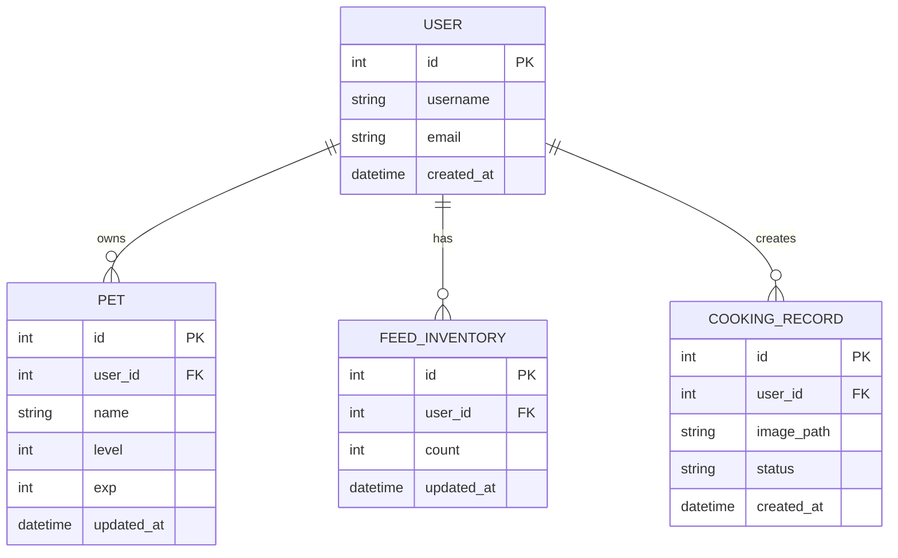

# 隨食隨地 - 資料庫設計文件 (DB Design)

## 1. ER 圖（實體關係圖）

## 2. 資料表詳細說明

### 2.1 USER (使用者表)
儲存系統使用者的基本資訊。
- `id` (INTEGER, PK): 使用者唯一識別碼
- `username` (VARCHAR, 必填): 使用者名稱
- `email` (VARCHAR, 必填, 唯一): 電子郵件
- `created_at` (DATETIME): 帳號建立時間

### 2.2 PET (虛擬寵物表)
儲存每位使用者的虛擬寵物狀態 (F-03)。
- `id` (INTEGER, PK): 寵物唯一識別碼
- `user_id` (INTEGER, FK): 關聯的使用者 ID
- `name` (VARCHAR, 必填): 寵物名稱
- `level` (INTEGER, 必填): 當前等級，預設 1
- `exp` (INTEGER, 必填): 當前經驗值，預設 0
- `updated_at` (DATETIME): 最後狀態更新時間

### 2.3 FEED_INVENTORY (飼料庫存表)
管理使用者透過回報料理獲得的虛擬飼料數量 (F-04)。
- `id` (INTEGER, PK): 庫存紀錄識別碼
- `user_id` (INTEGER, FK): 關聯的使用者 ID
- `count` (INTEGER, 必填): 飼料數量，預設 0
- `updated_at` (DATETIME): 庫存最後變動時間

### 2.4 COOKING_RECORD (烹飪紀錄表)
紀錄使用者回報的料理紀錄，用作發放飼料的依據 (F-04)。
- `id` (INTEGER, PK): 紀錄唯一識別碼
- `user_id` (INTEGER, FK): 關聯的使用者 ID
- `image_path` (VARCHAR, 可空): 上傳的料理圖片路徑
- `status` (VARCHAR, 必填): 紀錄狀態（如 'completed'）
- `created_at` (DATETIME): 紀錄提交時間
