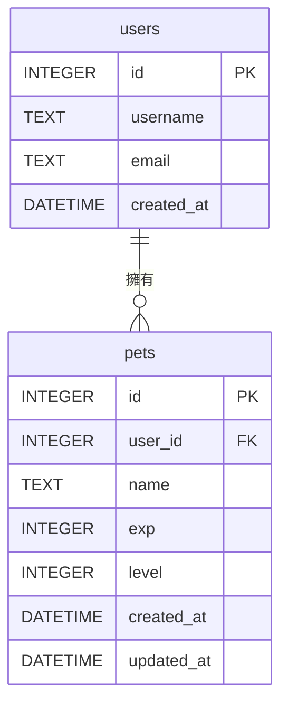

# 資料庫設計 - 虛擬寵物養成系統 (F-03)

本文件根據產品需求文件（PRD）與架構文件，定義「虛擬寵物養成系統」所需的 SQLite 資料庫表格設計、欄位與關聯。

---

## 1. ER 圖（實體關係圖）

---

## 2. 資料表詳細說明

### 2.1 `users` 資料表
負責儲存系統中的使用者基本資訊。

| 欄位名稱 | 型別 | 屬性 | 說明 |
| :--- | :--- | :--- | :--- |
| `id` | INTEGER | PRIMARY KEY, AUTOINCREMENT | 使用者唯一識別碼 |
| `username` | TEXT | NOT NULL, UNIQUE | 使用者名稱 |
| `email` | TEXT | NOT NULL, UNIQUE | 使用者信箱 |
| `created_at` | DATETIME | DEFAULT CURRENT_TIMESTAMP | 帳號建立時間 |

### 2.2 `pets` 資料表
負責儲存每位使用者的虛擬寵物狀態。為未來擴充保留彈性，一位使用者理論上可擁有多隻寵物，但目前 MVP 階段限制為一隻。

| 欄位名稱 | 型別 | 屬性 | 說明 |
| :--- | :--- | :--- | :--- |
| `id` | INTEGER | PRIMARY KEY, AUTOINCREMENT | 寵物唯一識別碼 |
| `user_id` | INTEGER | FOREIGN KEY, NOT NULL | 對應 `users.id`，表示寵物的主人 |
| `name` | TEXT | NOT NULL | 寵物的名字 |
| `exp` | INTEGER | DEFAULT 0 | 寵物的目前經驗值 |
| `level` | INTEGER | DEFAULT 1 | 寵物的目前等級 |
| `created_at` | DATETIME | DEFAULT CURRENT_TIMESTAMP | 寵物領養/建立時間 |
| `updated_at` | DATETIME | DEFAULT CURRENT_TIMESTAMP | 寵物狀態最後更新時間 |

**關聯說明：**
- `user_id` 是一個 Foreign Key，關聯至 `users(id)`。當使用者被刪除時，應同步刪除對應的寵物（`ON DELETE CASCADE`）。
