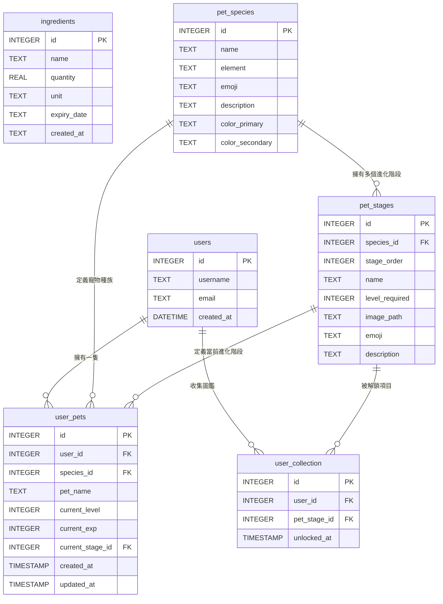

# 隨「食」隨地 — 資料庫設計文件 (Database Design)

本文件詳細說明隨「食」隨地系統所使用的 SQLite 資料庫實體關係圖 (ER 圖)、各資料表的欄位定義以及關聯設計。

---

## 1. ER 圖 (Entity-Relationship Diagram)

系統中各實體（食材庫存、使用者、寵物種族、進化階段、使用者寵物、解鎖圖鑑）的關係如下：

---

## 2. 資料表欄位詳細說明

### 2.1 `ingredients` (食材庫存表 - F-01)
記錄使用者擁有的食材庫存、數量與過期時間。

| 欄位名稱 | 型別 | 必填 | 說明 |
| :--- | :--- | :--- | :--- |
| `id` | INTEGER | 是 | 主鍵，自動遞增。 |
| `name` | TEXT | 是 | 食材名稱，如「高麗菜」、「雞蛋」。 |
| `quantity` | REAL | 是 | 食材數量（支援小數，如 0.5）。 |
| `unit` | TEXT | 否 | 數量單位，如「顆」、「克」、「ml」。 |
| `expiry_date` | TEXT | 否 | 保存期限 (ISO YYYY-MM-DD)。 |
| `created_at` | TEXT | 是 | 資料新增時間。 |

---

### 2.2 `users` (使用者帳號表 - F-03/F-06)
儲存使用者的基本帳號資料。

| 欄位名稱 | 型別 | 必填 | 說明 |
| :--- | :--- | :--- | :--- |
| `id` | INTEGER | 是 | 主鍵，自動遞增。 |
| `username` | TEXT | 是 | 使用者帳號，必須唯一。 |
| `email` | TEXT | 是 | 電子信箱，必須唯一。 |
| `created_at` | DATETIME | 是 | 帳號建立時間。 |

---

### 2.3 `pet_species` (寵物種族定義表 - F-06)
定義可供選擇的寵物種族（如小食怪、焰靈龍、鮮綠兔）。

| 欄位名稱 | 型別 | 必填 | 說明 |
| :--- | :--- | :--- | :--- |
| `id` | INTEGER | 是 | 主鍵，自動遞增。 |
| `name` | TEXT | 是 | 種族名稱，必須唯一。 |
| `element` | TEXT | 是 | 屬性分類 (cooking, fire, nature)。 |
| `emoji` | TEXT | 是 | 代表 Emoji 符號。 |
| `description` | TEXT | 否 | 種族背景風味說明。 |
| `color_primary` | TEXT | 是 | 主題主要配色 (HEX)，用於網頁 UI 渲染。 |
| `color_secondary` | TEXT | 是 | 主題次要配色 (HEX)，用於網頁 UI 渲染。 |

---

### 2.4 `pet_stages` (寵物進化階段定義表 - F-06)
定義每個種族在各個等級所對應的進化型態與外觀。

| 欄位名稱 | 型別 | 必填 | 說明 |
| :--- | :--- | :--- | :--- |
| `id` | INTEGER | 是 | 主鍵，自動遞增。 |
| `species_id` | INTEGER | 是 | 外鍵，指向 `pet_species(id)`。 |
| `stage_order` | INTEGER | 是 | 進化順序 (1, 2, 3, 4)。 |
| `name` | TEXT | 是 | 進化階段型態名稱，如「食怪蛋」、「廚神大師」。 |
| `level_required`| INTEGER | 是 | 進化所需的等級門檻。 |
| `image_path` | TEXT | 是 | 寵物外觀圖片存放路徑。 |
| `emoji` | TEXT | 是 | 階段代表 Emoji (佔位與縮放用)。 |
| `description` | TEXT | 否 | 此階段型態的風味描述。 |

---

### 2.5 `user_pets` (使用者寵物狀態表 - F-03/F-06)
記錄每位使用者當前所養的寵物狀態（等級、經驗值、當前階段）。

| 欄位名稱 | 型別 | 必填 | 說明 |
| :--- | :--- | :--- | :--- |
| `id` | INTEGER | 是 | 主鍵，自動遞增。 |
| `user_id` | INTEGER | 是 | 外鍵，指向 `users(id)`，每位使用者限擁有一隻寵物。 |
| `species_id` | INTEGER | 是 | 外鍵，指向 `pet_species(id)`。 |
| `pet_name` | TEXT | 否 | 寵物暱稱。 |
| `current_level` | INTEGER | 是 | 寵物當前等級（預設 1）。 |
| `current_exp` | INTEGER | 是 | 寵物當前累積經驗值。 |
| `current_stage_id`| INTEGER | 是 | 外鍵，指向 `pet_stages(id)`，當前進化階段。 |
| `created_at` | TIMESTAMP| 是 | 寵物創立時間。 |
| `updated_at` | TIMESTAMP| 是 | 寵物狀態更新時間。 |

---

### 2.6 `user_collection` (使用者圖鑑解鎖記錄表 - F-06)
記錄使用者已解鎖的寵物進化階段，供圖鑑書隨時查閱。

| 欄位名稱 | 型別 | 必填 | 說明 |
| :--- | :--- | :--- | :--- |
| `id` | INTEGER | 是 | 主鍵，自動遞增。 |
| `user_id` | INTEGER | 是 | 外鍵，指向 `users(id)`。 |
| `pet_stage_id` | INTEGER | 是 | 外鍵，指向 `pet_stages(id)`。 |
| `unlocked_at` | TIMESTAMP| 是 | 解鎖的時間戳記。 |

---

## 3. 資料庫約束與自動化 (Triggers)

為確保資料完整性：
1. **外鍵級聯刪除 (Cascading Delete)**：當 `users` 被刪除時，其對應的 `user_pets` 以及圖鑑解鎖記錄 `user_collection` 將自動被級聯刪除。
2. **唯一性約束 (Unique Constraints)**：
   - 每位 `user_id` 在 `user_pets` 中最多僅有一筆資料，以確保一位使用者只能養一隻寵物。
   - `user_id` 與 `pet_stage_id` 在 `user_collection` 中組成聯合唯一，避免重複解鎖同一筆圖鑑。
