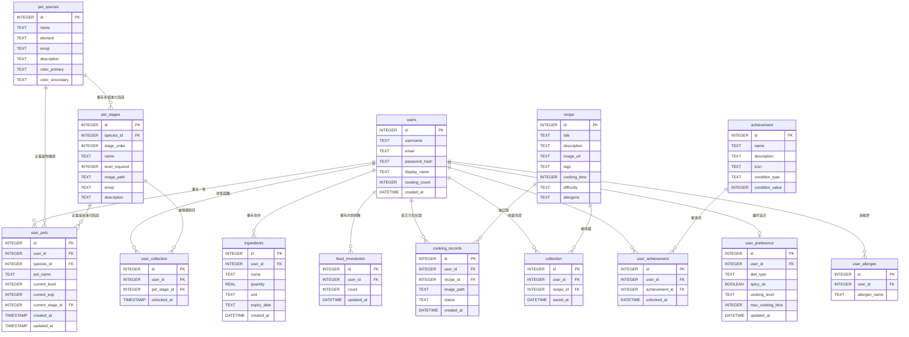

# 隨「食」隨地 — 資料庫設計文件 (Database Design)

本文件基於 `docs/PRD.md` 與 `docs/ARCHITECTURE.md`，定義系統的資料庫結構與實體關聯圖 (ERD)。系統使用 SQLite 作為資料庫，並同時採用 SQLAlchemy ORM 與原生 sqlite3 進行存取。

---

## 1. ER 圖 (Entity-Relationship Diagram)

系統中各實體（食材庫存、使用者、飲食偏好、過敏原、收藏、成就、寵物種族、進化階段、使用者寵物、解鎖圖鑑、飼料庫存、烹飪紀錄）的關係如下：

---

## 2. 資料表欄位詳細說明

### 2.1 `ingredients` (食材庫存表 - F-01/F-03)
記錄使用者擁有的食材庫存、數量與過期時間。

| 欄位名稱 | 型別 | 必填 | 說明 |
| :--- | :--- | :--- | :--- |
| `id` | INTEGER | 是 | 主鍵，自動遞增。 |
| `user_id` | INTEGER | 是 | 外鍵，指向 `users(id)`，級聯刪除。 |
| `name` | TEXT | 是 | 食材名稱，如「高麗菜」、「雞蛋」。 |
| `quantity` | REAL | 是 | 食材數量（支援小數，如 0.5）。 |
| `unit` | TEXT | 否 | 數量單位，如「顆」、「克」、「把」。 |
| `expiry_date` | TEXT | 否 | 保存期限 (ISO YYYY-MM-DD)，F-03 過期提醒比對此欄位。 |
| `created_at` | DATETIME | 是 | 資料新增時間，預設為 `CURRENT_TIMESTAMP`。 |

---

### 2.2 `users` (使用者帳號表 - Auth)
儲存使用者的基本帳號與認證資料。

| 欄位名稱 | 型別 | 必填 | 說明 |
| :--- | :--- | :--- | :--- |
| `id` | INTEGER | 是 | 主鍵，自動遞增。 |
| `username` | TEXT | 是 | 使用者帳號，必須唯一。 |
| `email` | TEXT | 是 | 電子信箱，必須唯一。 |
| `password_hash`| TEXT | 否 | 加密後的密碼雜湊。 |
| `display_name` | TEXT | 否 | 顯示名稱。 |
| `cooking_count`| INTEGER | 是 | 烹飪完成累計次數（用於成就判定）。 |
| `created_at` | DATETIME | 是 | 帳號建立時間，預設為 `CURRENT_TIMESTAMP`。 |

---

### 2.3 `user_preference` (使用者飲食偏好 - F-07)
記錄使用者的飲食習慣與烹飪偏好，用於食譜過濾。

| 欄位名稱 | 型別 | 必填 | 說明 |
| :--- | :--- | :--- | :--- |
| `id` | INTEGER | 是 | 主鍵，自動遞增。 |
| `user_id` | INTEGER | 是 | 外鍵，指向 `users(id)`，唯一限制。 |
| `diet_type` | TEXT | 是 | 飲食類型 (omnivore/vegetarian/vegan/pescatarian)。 |
| `spicy_ok` | BOOLEAN | 是 | 是否接受辣。 |
| `cooking_level` | TEXT | 是 | 烹飪等級 (beginner/intermediate/advanced)。 |
| `max_cooking_time` | INTEGER | 是 | 最長烹飪時間(分鐘)。 |
| `updated_at` | DATETIME | 是 | 最後更新時間。 |

---

### 2.4 `recipe` (食譜表 - F-02/F-07)
支援 F-02 (食譜推薦) 與 F-07 (偏好過濾)。

| 欄位名稱 | 型別 | 必填 | 說明 |
| :--- | :--- | :--- | :--- |
| `id` | INTEGER | 是 | 主鍵，自動遞增。 |
| `title` | TEXT | 是 | 食譜標題。 |
| `description` | TEXT | 否 | 食譜步驟說明。 |
| `image_url` | TEXT | 否 | 食譜配圖網址。 |
| `tags` | TEXT | 否 | 逗號分隔標籤，如 `vegetarian,spicy,quick`。 |
| `cooking_time` | INTEGER | 是 | 烹飪所需時間(分鐘)。 |
| `difficulty` | TEXT | 是 | 難易度 (beginner/intermediate/advanced)。 |
| `allergens` | TEXT | 否 | 逗號分隔過敏原，如 `egg,milk`。 |

---

### 2.5 `pet_species` (寵物種族定義表 - F-06)
定義可供選擇的寵物種族（如小食怪、焰靈龍、鮮綠兔）。

| 欄位名稱 | 型別 | 必填 | 說明 |
| :--- | :--- | :--- | :--- |
| `id` | INTEGER | 是 | 主鍵，自動遞增。 |
| `name` | TEXT | 是 | 種族名稱，必須唯一。 |
| `element` | TEXT | 是 | 屬性分類 (cooking/fire/nature)。 |
| `emoji` | TEXT | 是 | 代表 Emoji 符號。 |
| `description` | TEXT | 否 | 種族背景風味說明。 |
| `color_primary` | TEXT | 是 | 主題主要配色 (HEX)，用於 UI 渲染。 |
| `color_secondary` | TEXT | 是 | 主題次要配色 (HEX)，用於 UI 渲染。 |

---

### 2.6 `pet_stages` (寵物進化階段定義表 - F-06)
定義每個種族在各個等級所對應的進化型態與外觀。

| 欄位名稱 | 型別 | 必填 | 說明 |
| :--- | :--- | :--- | :--- |
| `id` | INTEGER | 是 | 主鍵，自動遞增。 |
| `species_id` | INTEGER | 是 | 外鍵，指向 `pet_species(id)`。 |
| `stage_order` | INTEGER | 是 | 進化順序 (1, 2, 3, 4)。 |
| `name` | TEXT | 是 | 進化階段型態名稱，如「食怪蛋」、「廚神大師」。 |
| `level_required`| INTEGER | 是 | 進化所需的等級門檻。 |
| `image_path` | TEXT | 是 | 寵物外觀圖片存放路徑。 |
| `emoji` | TEXT | 是 | 階段代表 Emoji。 |
| `description` | TEXT | 否 | 此階段型態的風味描述。 |

---

### 2.7 `user_pets` (使用者寵物狀態表 - F-03/F-06)
記錄每位使用者當前所養的寵物狀態（等級、經驗值、當前階段）。

| 欄位名稱 | 型別 | 必填 | 說明 |
| :--- | :--- | :--- | :--- |
| `id` | INTEGER | 是 | 主鍵，自動遞增。 |
| `user_id` | INTEGER | 是 | 外鍵，指向 `users(id)`，每位使用者限擁有一隻寵物。 |
| `species_id` | INTEGER | 是 | 外鍵，指向 `pet_species(id)`。 |
| `pet_name` | TEXT | 否 | 寵物暱稱。 |
| `current_level` | INTEGER | 是 | 寵物當前等級（預設 1）。 |
| `current_exp` | INTEGER | 是 | 寵物當前累積經驗值。 |
| `current_stage_id`| INTEGER | 是 | 外鍵，指向 `pet_stages(id)`，當前進化階段。 |
| `created_at` | TIMESTAMP| 是 | 寵物創立時間。 |
| `updated_at` | TIMESTAMP| 是 | 寵物狀態更新時間。 |

---

### 2.8 `user_collection` (使用者圖鑑解鎖記錄表 - F-06)
記錄使用者已解鎖的寵物進化階段，供圖鑑書隨時查閱。

| 欄位名稱 | 型別 | 必填 | 說明 |
| :--- | :--- | :--- | :--- |
| `id` | INTEGER | 是 | 主鍵，自動遞增。 |
| `user_id` | INTEGER | 是 | 外鍵，指向 `users(id)`。 |
| `pet_stage_id` | INTEGER | 是 | 外鍵，指向 `pet_stages(id)`。 |
| `unlocked_at` | TIMESTAMP| 是 | 解鎖的時間戳記。 |

---

### 2.9 `feed_inventories` (飼料庫存表 - F-04)
記錄並管理使用者擁有的飼料數量。

| 欄位名稱 | 型別 | 必填 | 說明 |
| :--- | :--- | :--- | :--- |
| `id` | INTEGER | 是 | 主鍵，自動遞增。 |
| `user_id` | INTEGER | 是 | 外鍵，指向 `users(id)`，級聯刪除。 |
| `count` | INTEGER | 是 | 擁有的飼料數量，預設 0。 |
| `updated_at` | DATETIME | 是 | 庫存最後變動時間。 |

---

### 2.10 `cooking_records` (烹飪紀錄表 - F-04)
記錄使用者回報的料理成品與狀態，作為發放飼料依據。

| 欄位名稱 | 型別 | 必填 | 說明 |
| :--- | :--- | :--- | :--- |
| `id` | INTEGER | 是 | 主鍵，自動遞增。 |
| `user_id` | INTEGER | 是 | 外鍵，指向 `users(id)`，級聯刪除。 |
| `recipe_id` | INTEGER | 否 | 外鍵，指向 `recipe(id)`，對應完成的食譜。 |
| `image_path` | TEXT | 否 | 上傳的料理照片相對路徑（如 `uploads/xxx.png`）。 |
| `status` | TEXT | 是 | 回報狀態，如 `completed`。 |
| `created_at` | DATETIME | 是 | 資料提交時間，預設為 `CURRENT_TIMESTAMP`。 |

---

## 3. SQL 建表語法

本專案的完整建表語法儲存於 [schema.sql](../database/schema.sql)。

---

## 4. Python Model 程式碼設計

為了實作資料庫的 CRUD 操作，所有 Model 統一封裝於 `app/models/` 目錄：

### 4.1 食材庫存 Model：`Ingredient`
檔案位置：[ingredient.py](../app/models/ingredient.py) — SQLAlchemy ORM，支援 F-01/F-03。

### 4.2 寵物狀態 Model：`Pet`
檔案位置：[pet.py](../app/models/pet.py) — 整合 F-03 寵物狀態與 F-06 進化引擎。

### 4.3 寵物圖鑑 Model：`Collection`
檔案位置：[collection.py](../app/models/collection.py) — 處理 F-06 圖鑑解鎖查詢。

### 4.4 飼料庫存 ORM Model：`FeedInventory`
檔案位置：[feed_inventory.py](../app/models/feed_inventory.py) — SQLAlchemy ORM，處理飼料庫存變動。

### 4.5 烹飪紀錄 ORM Model：`CookingRecord`
檔案位置：[cooking_record.py](../app/models/cooking_record.py) — SQLAlchemy ORM，處理烹飪回報紀錄。

### 4.6 食譜 ORM Model：`Recipe`
檔案位置：[recipe.py](../app/models/recipe.py) — SQLAlchemy ORM，支援 F-02/F-07 偏好過濾欄位。
