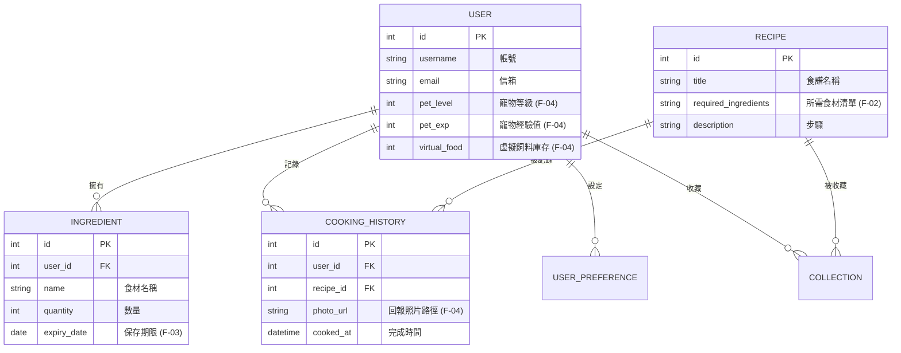

# 隨食隨地 - 資料庫設計文件 (DB Design)

本文件基於 `docs/PRD.md` 與 `docs/ARCHITECTURE.md`，定義系統的資料庫結構與實體關聯圖 (ERD)。我們使用 SQLite 搭配 SQLAlchemy ORM。

## 1. 實體關聯圖 (Entity-Relationship Diagram)

## 2. 資料表說明與 SQLAlchemy 欄位定義

### 2.1 User (使用者表)
負責記錄登入資訊與**寵物狀態**。
- `id` (Integer, Primary Key)
- `pet_level` (Integer): 寵物等級，預設 1。
- `pet_exp` (Integer): 寵物當前累積經驗值，預設 0。
- `virtual_food` (Integer): 可用的虛擬飼料數量，透過烹飪回報獲得。

### 2.2 Ingredient (我的材料庫)
支援 **F-01 (食材管理)** 與 **F-03 (過期提醒)**。
- `id` (Integer, Primary Key)
- `user_id` (Integer, Foreign Key -> User.id)
- `name` (String): 食材名稱。
- `quantity` (Integer): 數量。
- `expiry_date` (Date): 保存期限。過期提醒將比對此欄位。

### 2.3 Recipe (食譜庫)
支援 **F-02 (食譜推薦)**。
- `id` (Integer, Primary Key)
- `title` (String): 食譜標題。
- `required_ingredients` (Text): 紀錄此食譜需要的食材字串 (可為 JSON 或純文字)，用於在推薦時比對 `Ingredient`。

### 2.4 CookingHistory (烹飪歷史)
支援 **F-04 (烹飪回報)** 與 **F-05 (成就紀錄)**。
- `id` (Integer, Primary Key)
- `user_id` (Integer, Foreign Key -> User.id)
- `recipe_id` (Integer, Foreign Key -> Recipe.id): 對應完成的食譜。
- `photo_url` (String): 若使用者選擇拍照回報，此欄位儲存圖檔路徑。
- `cooked_at` (DateTime): 紀錄完成時間。

*(註：詳細的欄位與其他衍生功能表，如 `Collection`、`Achievement`，請參閱實際的 `models.py` 程式碼)*
