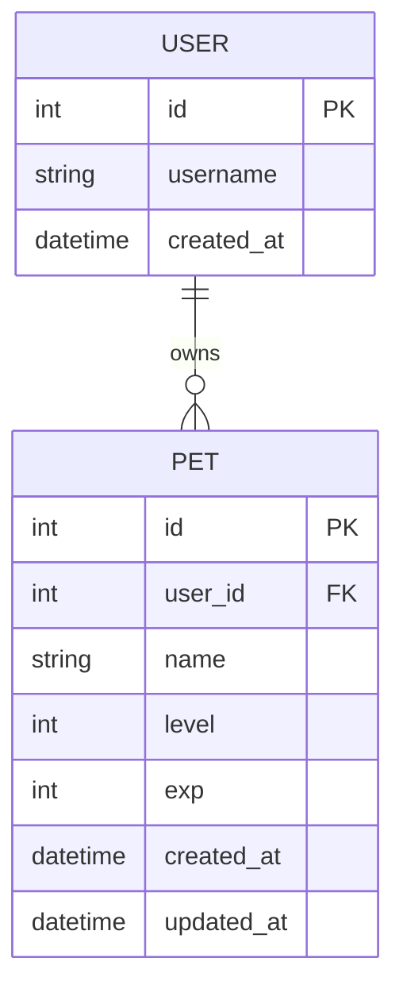

# 隨食隨地 - 資料庫設計 (F-03 虛擬寵物養成系統)

本文件根據 `PRD_F-03.md` 與 `FLOWCHART.md` 設計了「虛擬寵物養成系統」所需的 SQLite 資料庫結構。

## 1. ER 圖（實體關係圖）

## 2. 資料表詳細說明

### 2.1 USER (使用者表)
儲存使用者的基本資訊。由於目前主要是針對寵物系統進行設計，使用者表僅提供基礎欄位供外鍵關聯。

| 欄位名稱 | 型別 | 屬性 | 說明 |
| --- | --- | --- | --- |
| id | INTEGER | PK, AUTOINCREMENT | 使用者唯一識別碼 |
| username | TEXT | NOT NULL | 使用者名稱 |
| created_at | DATETIME | DEFAULT CURRENT_TIMESTAMP | 帳號建立時間 |

### 2.2 PET (虛擬寵物表)
儲存每位使用者的寵物狀態，包含等級與經驗值，會隨著「餵食」API 動態更新。

| 欄位名稱 | 型別 | 屬性 | 說明 |
| --- | --- | --- | --- |
| id | INTEGER | PK, AUTOINCREMENT | 寵物唯一識別碼 |
| user_id | INTEGER | FK (USER.id) | 擁有此寵物的使用者 ID |
| name | TEXT | NOT NULL | 寵物名稱 |
| level | INTEGER | DEFAULT 1 | 寵物目前等級 |
| exp | INTEGER | DEFAULT 0 | 寵物目前累積的經驗值 |
| created_at | DATETIME | DEFAULT CURRENT_TIMESTAMP | 寵物領養時間 |
| updated_at | DATETIME | DEFAULT CURRENT_TIMESTAMP | 最後一次餵食/更新狀態的時間 |

## 3. SQL 建表語法
完整的建表語法已儲存於 `database/schema.sql` 中。

## 4. Python Model
已在 `app/models/` 目錄下建立對應的 Python 模型，使用內建的 `sqlite3` 套件進行實作，包含完整的 CRUD 與餵食邏輯。
