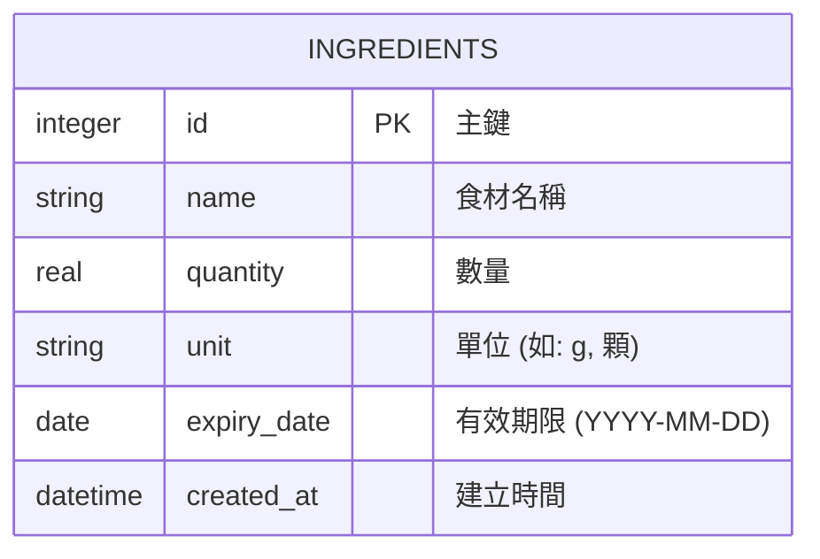

# 資料庫設計 - 智慧食譜推薦系統 (F-02)

本文件依據前期的設計規劃，定義了「我的材料庫」底層資料庫的結構與關聯，並提供對應的建表語法。

## 1. ER 圖（實體關係圖）

本系統的核心在於管理使用者的可用食材，作為向外部 API 請求食譜推薦的基礎。由於目前為 MVP 版本，主要設計 `ingredients` 資料表。

## 2. 資料表詳細說明

### `ingredients` (我的材料庫)
儲存使用者目前擁有的食材清單，作為食譜推薦系統的查詢基準。

| 欄位名稱 | 型別 | 必填 | 說明 |
| :--- | :--- | :---: | :--- |
| `id` | INTEGER | ✅ | 主鍵 (Primary Key)，自動遞增 |
| `name` | TEXT | ✅ | 食材名稱（例如：雞肉、洋蔥、番茄） |
| `quantity` | REAL | ✅ | 剩餘數量 |
| `unit` | TEXT | ✅ | 數量單位（例如：g, kg, 顆, 把） |
| `expiry_date` | TEXT | ❌ | 有效期限，ISO 格式 `YYYY-MM-DD`，用於優先推薦即期食材 |
| `created_at` | DATETIME | ✅ | 建立時間，預設為 `CURRENT_TIMESTAMP` |

## 3. SQL 建表語法

SQLite 建表語法已儲存於 `database/schema.sql`，可用於初始化系統資料庫。

## 4. Python Model 程式碼

處理對 SQLite 資料庫的 CRUD (建立、讀取、更新、刪除) 操作邏輯，已實作於 `app/models/ingredient.py`，使用 Python 內建的 `sqlite3` 模組，保持系統輕量化。
