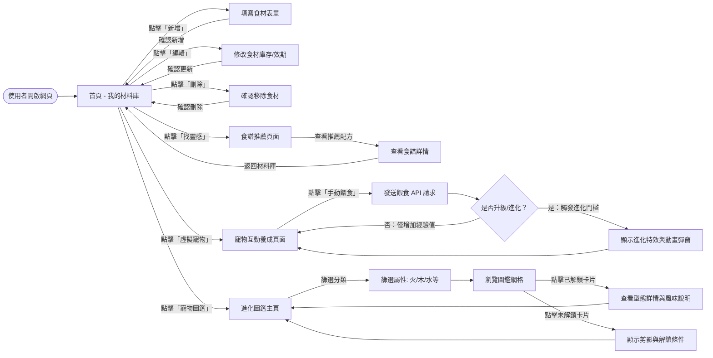
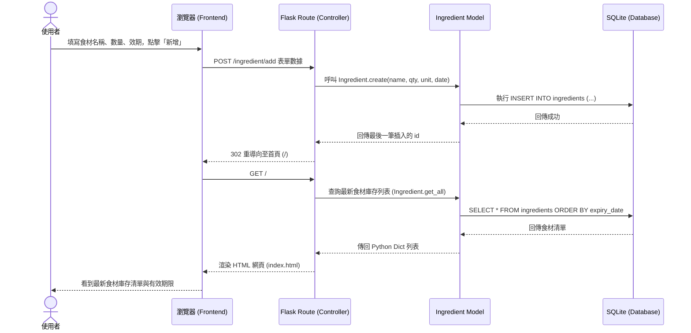
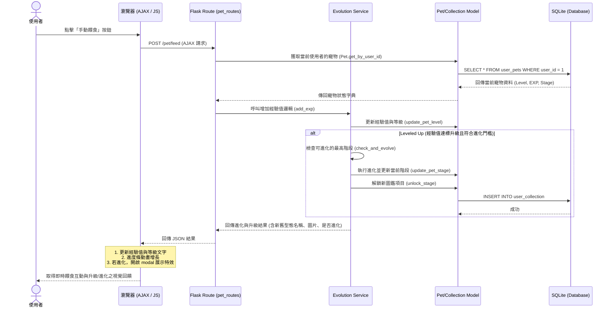

# 隨「食」隨地 — 使用者流程圖與系統流程圖 (Flowchart)

本文件使用 Mermaid 流程圖與序列圖，視覺化「隨食隨地」系統中各功能模組（食材管理、食譜推薦、虛擬寵物養成、進化圖鑑）的使用者操作路徑與系統內部資料流。

---

## 1. 全域使用者流程圖 (User Flow)

描述使用者進入網站後，可以在各功能模組之間導覽與操作的完整路徑：

---

## 2. 系統序列圖 (Sequence Diagrams)

### 2.1 食材管理功能 (F-01) — 手動新增食材
展示使用者新增食材時，前端瀏覽器與後端 Flask、資料庫 Model 的典型交互：

### 2.2 寵物養成與進化功能 (F-03/F-06) — 餵食與進化判定
展示餵食時，前端發送非同步 AJAX 請求，後端調用 Service 層進行經驗計算與進化圖鑑解鎖的資料流：

---

## 3. 功能清單對照表 (Feature-to-Route Mapping)

以下為隨食隨地系統各功能模組所對應的 URL 路徑、HTTP 方法與控制器說明：

| 功能編號 | 功能名稱 | HTTP 方法 | URL 路徑 | 對應控制器與方法 | 渲染模板 / 回傳格式 | 說明 |
| :--- | :--- | :---: | :--- | :--- | :--- | :--- |
| **F-01** | 我的材料庫首頁 | `GET` | `/` | `ingredient.index` | `ingredients/index.html` | 列出目前所有食材與新增食材表單 |
| **F-01** | 新增食材 | `POST` | `/ingredient/add` | `ingredient.add` | 重導向至 `/` | 接收新增食材表單，寫入庫存後導回 |
| **F-01** | 編輯食材頁面 | `GET` | `/ingredient/edit/<id>` | `ingredient.edit` | `ingredients/edit.html` | 呈現單一食材修改表單 |
| **F-01** | 更新食材 | `POST` | `/ingredient/update/<id>`| `ingredient.update`| 重導向至 `/` | 接收編輯欄位更新庫存後導回 |
| **F-01** | 刪除食材 | `POST` | `/ingredient/delete/<id>`| `ingredient.delete`| 重導向至 `/` | 刪除指定食材後導回 |
| **F-02** | 推薦食譜 | `GET` | `/recipes/recommend` | `recipe.recommend` | `recipes/recommend.html` | 根據現有材料推薦合適食譜 (Skeleton) |
| **F-03** | 虛擬寵物首頁 | `GET` | `/pet` | `pet.pet_index` | `pet/index.html` | 呈現寵物數據、等級、餵食與進化觸發 |
| **F-03** | 手動餵食互動 | `POST` | `/pet/feed` | `pet.feed_pet` | JSON | 餵食加經驗值，自動升級進化並回傳 |
| **F-06** | 圖鑑主頁面 | `GET` | `/collection` | `collection.collection_index`| `collection/index.html` | 顯示所有寵物圖鑑與解鎖進度 |
| **F-06** | 型態詳情頁面 | `GET` | `/collection/<id>` | `collection.collection_detail`| `collection/detail.html` | 查看單一進化階段型態之風味說明與關係圖 |
| **F-06** | API：寵物狀態 | `GET` | `/api/pet/status` | `collection.api_pet_status`| JSON | 提供非同步輪詢或讀取寵物最新狀態 |
| **F-06** | API：加經驗值 | `POST` | `/api/pet/add-exp` | `collection.api_add_exp` | JSON | 供其他遊戲化功能或開發測試調用加 EXP |
| **F-06** | API：檢查進化 | `POST` | `/api/pet/evolve` | `collection.api_evolve` | JSON | 提供手動觸發進化狀態判定 |
| **F-06** | API：圖鑑資料 | `GET` | `/api/collection` | `collection.api_collection` | JSON | 回傳所有進化階段之解鎖清單與進度 |
| **F-06** | API：型態詳情 | `GET` | `/api/collection/<id>`| `collection.api_collection_detail`| JSON | 取得單一進化階段型態之 API 格式資料 |
