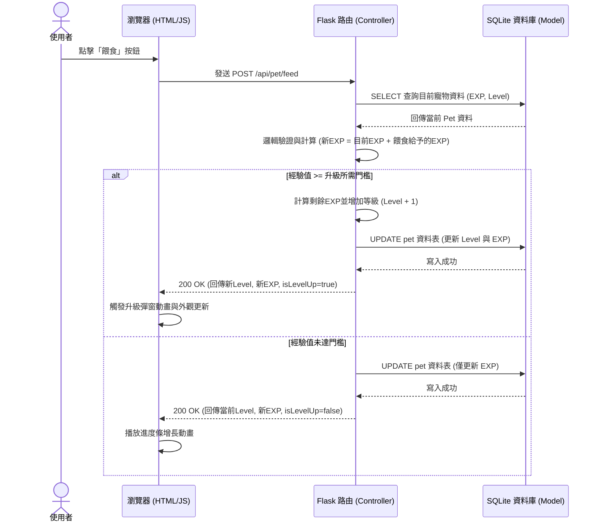

# 隨食隨地 - 系統流程圖 (F-03 虛擬寵物養成系統)

本文件根據 `PRD_F-03.md` 與 `ARCHITECTURE.md`，規劃了「虛擬寵物養成系統」的使用者操作動線與後端資料流。

## 1. 使用者流程圖（User Flow）

描述使用者從進入網站到完成餵食並升級的操作路徑。

```mermaid
flowchart LR
    A([使用者登入系統]) --> B[進入首頁]
    B --> C[點擊導覽列「我的寵物」]
    C --> D[寵物專屬頁面\n(顯示目前外觀、等級、EXP進度條)]
    
    D --> E{使用者執行操作}
    E -->|完成料理/點擊餵食| F[送出「餵食」請求]
    E -->|瀏覽其他頁面| B
    
    F --> G[獲得經驗值 (EXP)]
    G --> H{經驗值是否達標？}
    
    H -->|是 (Level Up)| I[觸發升級特效、等級+1、變更外觀]
    H -->|否| J[更新進度條長度]
    
    I --> D
    J --> D
```

## 2. 系統序列圖（Sequence Diagram）

描述使用者點擊「餵食」後，前端、Flask 後端與 SQLite 資料庫之間的完整互動與驗證邏輯。



## 3. 功能清單對照表

根據架構文件，以下是針對虛擬寵物養成功能規劃的路由與對應方法：

| 功能名稱 | 功能說明 | URL 路徑 | HTTP 方法 |
| --- | --- | --- | --- |
| 寵物專屬頁面 | 回傳包含寵物畫面的 Jinja2 網頁模板 | `/pet` | GET |
| 餵食寵物 API | 接收前端的非同步餵食指令，於後端計算經驗值與升級邏輯 | `/api/pet/feed` | POST |
| 取得寵物狀態 API | 供前端非同步獲取最新等級與經驗值 (更新畫面用) | `/api/pet/status` | GET |
