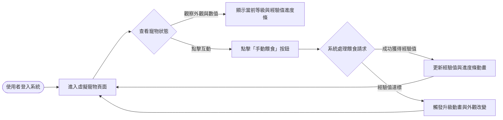
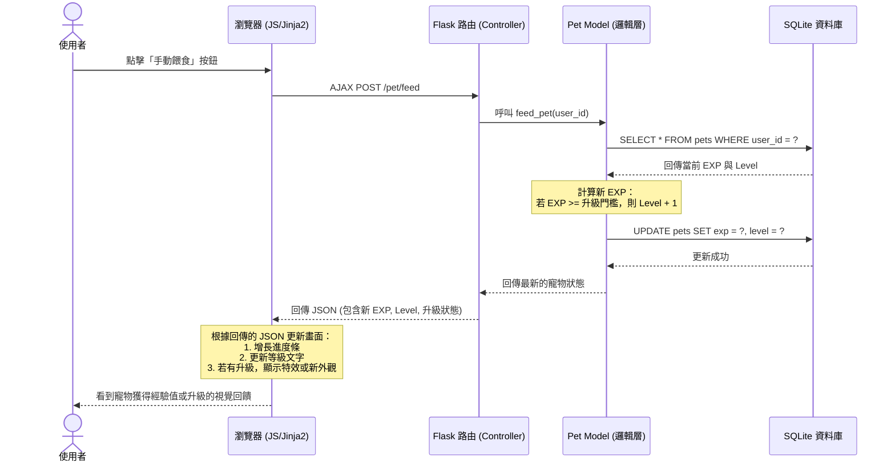

# 流程圖設計 - 虛擬寵物養成系統 (F-03)

本文件根據產品需求文件（PRD）與系統架構文件（ARCHITECTURE），視覺化「虛擬寵物養成系統」的使用者操作路徑與系統內部的資料流動。

---

## 1. 使用者流程圖（User Flow）

描述使用者在系統中如何操作與互動的路徑。

---

## 2. 系統序列圖（Sequence Diagram）

描述使用者點擊「手動餵食」後，前端與後端及資料庫之間完整的互動過程。

---

## 3. 功能清單對照表

以下為 F-03 系統對應的路由與 HTTP 方法設計，作為實作時的參考依據。

| 功能項目 | HTTP 方法 | URL 路徑 | 說明 |
| :--- | :---: | :--- | :--- |
| **寵物專屬展示頁面** | `GET` | `/pet` | 載入包含寵物圖片、等級、經驗值進度條的 HTML 頁面。 |
| **手動觸發餵食 (互動)** | `POST` | `/pet/feed` | 透過 AJAX 呼叫，增加經驗值並處理升級邏輯，回傳更新後的 JSON 狀態。 |
| **獲取最新寵物狀態** | `GET` | `/api/pet/status` | (Nice to Have) 若未來需要非同步輪詢狀態，可提供此 API 回傳 JSON。 |
