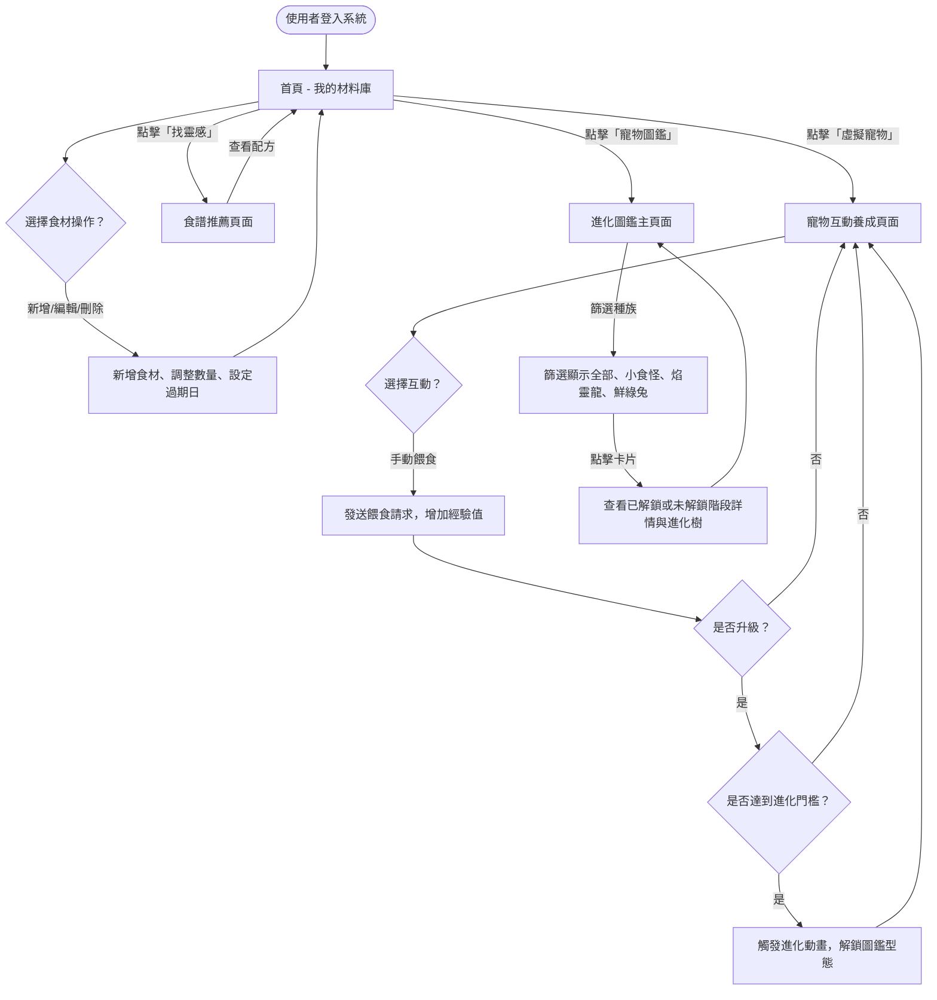
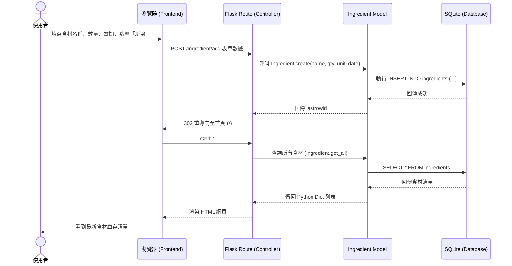
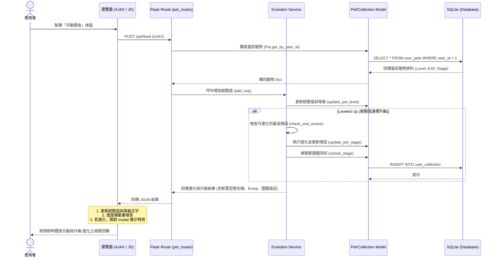

# 隨「食」隨地 — 使用者流程圖與系統流程圖 (Flowchart)

本文件使用 Mermaid 流程圖，視覺化隨食隨地系統中各功能模組（食材管理、虛擬寵物養成、進化圖鑑）的使用者操作路徑與系統內部資料流。

---

## 1. 全域使用者流程圖 (User Flow)

描述使用者登入網站後，可在各模組之間切換與操作的路徑：

---

## 2. 系統互動序列圖 (Sequence Diagrams)

### 2.1 食材管理功能 (F-01) — 手動新增食材
展示瀏覽器前端與 Flask 後端、資料庫的模型交互：

---

### 2.2 寵物養成與進化功能 (F-03/F-06) — 手動餵食與自動進化
展示餵食時，前端非同步 AJAX 與後端自動經驗計算、進化解鎖的關聯：

