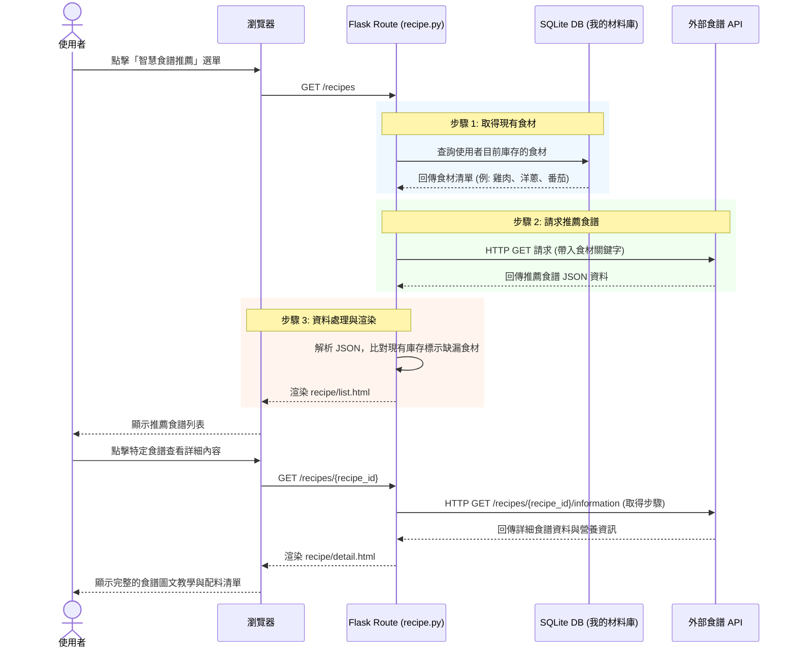

# 系統與使用者流程圖 - 智慧食譜推薦系統 (F-02)

本文件依據 `docs/PRD_F02_智慧食譜推薦系統.md` 與 `docs/ARCHITECTURE.md`，視覺化「智慧食譜推薦系統」的使用者操作路徑與系統內部的資料流動。

## 1. 使用者流程圖（User Flow）

描述使用者從進入系統到查看詳細食譜的完整操作路徑。

```mermaid
flowchart LR
    A([使用者進入系統]) --> B[首頁 / 導覽列]
    B --> C[點擊「智慧食譜推薦」]
    
    C --> D{系統處理中}
    D --> |1. 讀取我的材料庫\n2. 呼叫外部 API| E[食譜推薦列表頁]
    
    E --> F{使用者選擇動作}
    F -->|瀏覽清單| E
    F -->|點擊特定食譜| G[食譜詳細資訊頁]
    
    G --> H{詳細頁操作}
    H -->|查看烹飪步驟| I([準備開始烹飪])
    H -->|檢視缺漏食材| J([將缺漏食材加入採買清單 - 未來擴充])
    H -->|返回列表| E
# 隨食隨地 - 系統與使用者流程圖 (Flowchart)

根據產品需求文件 (F-03, F-04) 與系統架構設計，以下為「隨食隨地」系統的核心操作流程視覺化。

## 1. 使用者流程圖（User Flow）

此流程圖描述使用者從進入系統到完成「烹飪回報」與「餵食寵物」的操作路徑。

```mermaid
flowchart LR
    A([登入 / 進入系統]) --> B[首頁 / 儀表板]
    B --> C{選擇功能}
    
    %% 烹飪回報分支 (F-04)
    C -->|點擊回報料理| D[烹飪回報頁面]
    D --> E{上傳照片或直接勾選?}
    E -->|上傳圖片| F[預覽圖片並送出]
    E -->|直接勾選| G[送出完成狀態]
    F --> H[獲得虛擬飼料獎勵]
    G --> H
    H --> I([返回首頁或前往寵物頁])

    %% 寵物養成與餵食分支 (F-03, F-04)
    C -->|查看寵物| J[虛擬寵物頁面]
    J --> K{查看狀態與飼料}
    K -->|有飼料| L[點擊「餵食」按鈕]
    K -->|無飼料| M([提示去烹飪獲得飼料])
    L --> N[顯示經驗值增加動畫]
    N --> O{是否達標升級?}
    O -->|是| P[顯示升級通知與新外觀]
    O -->|否| Q([更新進度條並停留在該頁])
    P --> Q
```

## 2. 系統序列圖（Sequence Diagram）

描述使用者點擊「智慧食譜推薦」時，系統背後與資料庫及外部 API 溝通的完整流程。
此序列圖詳細描述使用者進行「烹飪回報」並接續「餵食寵物」時，系統前後端及資料庫的資料流動。



## 3. 功能清單對照表

以下為本功能規劃的頁面與對應的 URL 路徑、HTTP 方法及模板：

| 功能項目 | HTTP 方法 | URL 路徑 | 負責的 View (Template) | 說明 |
| :--- | :---: | :--- | :--- | :--- |
| **推薦食譜列表** | `GET` | `/recipes` | `recipe/list.html` | 讀取「我的材料庫」，呼叫外部食譜 API，顯示推薦清單與烹飪時間 |
| **食譜詳細頁面** | `GET` | `/recipes/<int:recipe_id>` | `recipe/detail.html` | 透過食譜 ID 呼叫 API，顯示詳細烹飪步驟、完整配料表與缺漏食材對比 |
    participant Browser as 瀏覽器 (Frontend)
    participant Flask as Flask Route (Controller)
    participant Model as SQLAlchemy (Model)
    participant DB as SQLite (Database)

    %% 第一階段：回報烹飪完成
    Note over User, DB: 階段一：烹飪回報並獲得飼料
    User->>Browser: 在烹飪頁面點擊「完成送出」
    Browser->>Flask: POST /cooking/report (含料理資料/照片)
    Flask->>Model: 呼叫新增紀錄與發放飼料邏輯
    Model->>DB: BEGIN TRANSACTION
    Model->>DB: INSERT INTO cooking_records
    Model->>DB: UPDATE feed_inventory SET count = count + 1
    DB-->>Model: 更新成功
    Model->>DB: COMMIT
    Flask-->>Browser: 回傳成功狀態 (JSON 或 Redirect)
    Browser-->>User: 顯示「成功獲得飼料！」提示

    %% 第二階段：餵食寵物
    Note over User, DB: 階段二：消耗飼料餵食寵物
    User->>Browser: 進入寵物頁面，點擊「餵食」按鈕
    Browser->>Flask: POST /pet/feed (AJAX 請求)
    Flask->>Model: 呼叫餵食邏輯
    Model->>DB: SELECT feed_count FROM feed_inventory
    DB-->>Model: 飼料數量 >= 1
    
    Model->>DB: BEGIN TRANSACTION
    Model->>DB: UPDATE feed_inventory SET count = count - 1
    Model->>DB: UPDATE pets SET exp = exp + 10
    
    opt 檢查是否升級
        Model->>Model: if exp >= level_up_threshold
        Model->>DB: UPDATE pets SET level = level + 1, exp = 0
    end
    
    DB-->>Model: 狀態更新成功
    Model->>DB: COMMIT
    Flask-->>Browser: 回傳 JSON {new_exp, level, remaining_feed}
    Browser-->>User: 播放餵食動畫與更新進度條
```

## 3. 功能清單與 API 對照表

以下為 F-03 與 F-04 功能所對應的 URL 路由設計：

| 功能模組 | 功能描述 | HTTP 方法 | URL 路徑 | Controller 處理邏輯 |
| :--- | :--- | :--- | :--- | :--- |
| **首頁** | 顯示系統首頁或功能入口 | GET | `/` | 渲染首頁 `index.html` |
| **烹飪回報** | 顯示烹飪回報表單頁面 | GET | `/cooking` | 渲染 `cooking.html` |
| **烹飪回報** | 送出烹飪紀錄與照片 | POST | `/cooking/report` | 處理上傳檔案、更新資料庫紀錄、增加飼料庫存 |
| **寵物養成** | 顯示虛擬寵物狀態頁面 | GET | `/pet` | 從資料庫取得寵物資料並渲染 `pet.html` |
| **寵物養成** | 觸發餵食動作 | POST | `/pet/feed` | 檢查庫存、扣除飼料、增加經驗值、判斷升級，回傳 JSON |
