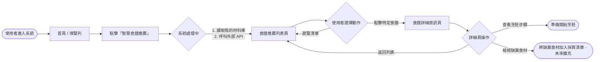
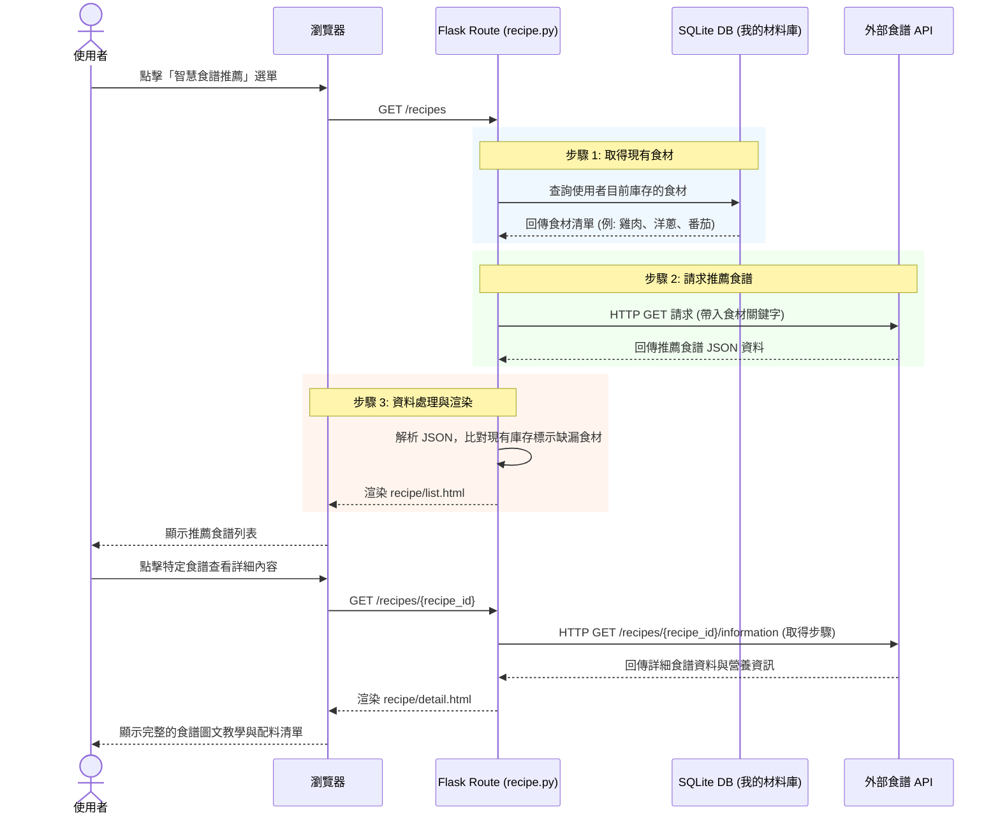

# 系統與使用者流程圖 - 智慧食譜推薦系統 (F-02)

本文件依據 `docs/PRD_F02_智慧食譜推薦系統.md` 與 `docs/ARCHITECTURE.md`，視覺化「智慧食譜推薦系統」的使用者操作路徑與系統內部的資料流動。

## 1. 使用者流程圖（User Flow）

描述使用者從進入系統到查看詳細食譜的完整操作路徑。

## 2. 系統序列圖（Sequence Diagram）

描述使用者點擊「智慧食譜推薦」時，系統背後與資料庫及外部 API 溝通的完整流程。

## 3. 功能清單對照表

以下為本功能規劃的頁面與對應的 URL 路徑、HTTP 方法及模板：

| 功能項目 | HTTP 方法 | URL 路徑 | 負責的 View (Template) | 說明 |
| :--- | :---: | :--- | :--- | :--- |
| **推薦食譜列表** | `GET` | `/recipes` | `recipe/list.html` | 讀取「我的材料庫」，呼叫外部食譜 API，顯示推薦清單與烹飪時間 |
| **食譜詳細頁面** | `GET` | `/recipes/<int:recipe_id>` | `recipe/detail.html` | 透過食譜 ID 呼叫 API，顯示詳細烹飪步驟、完整配料表與缺漏食材對比 |
