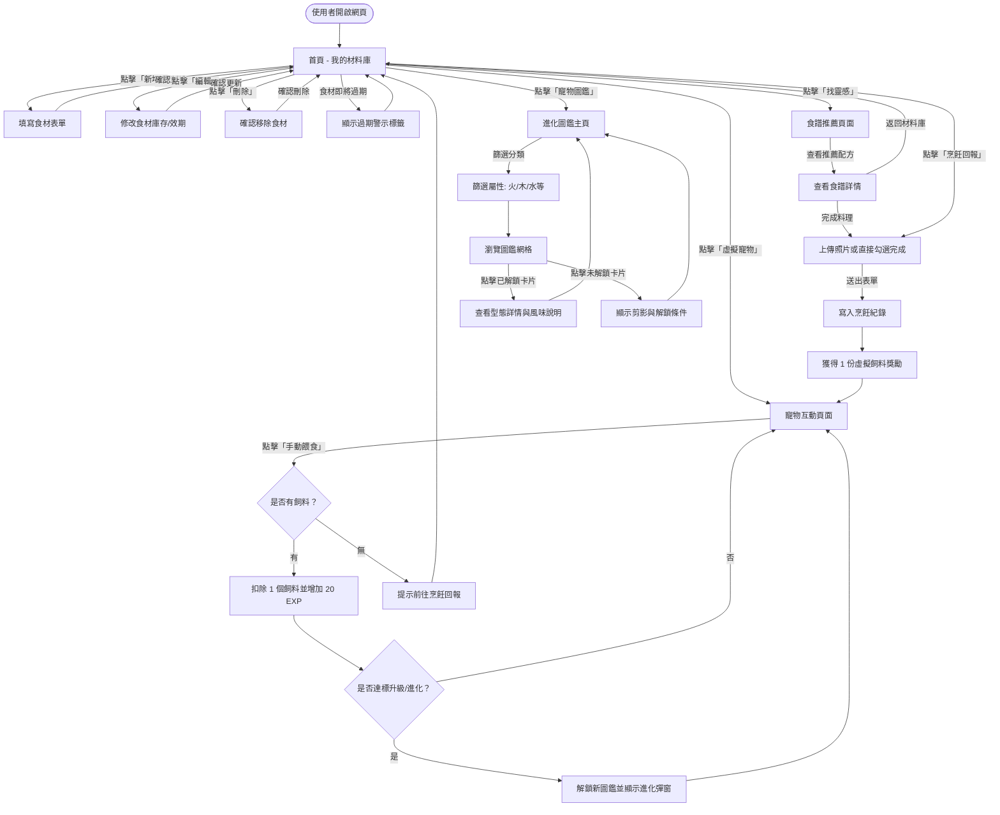
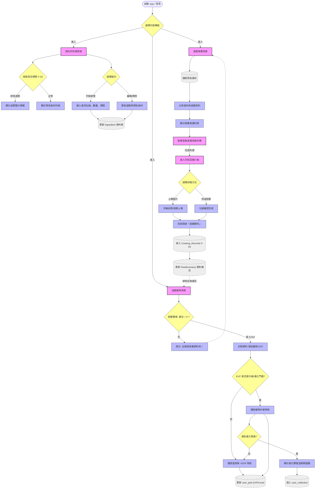
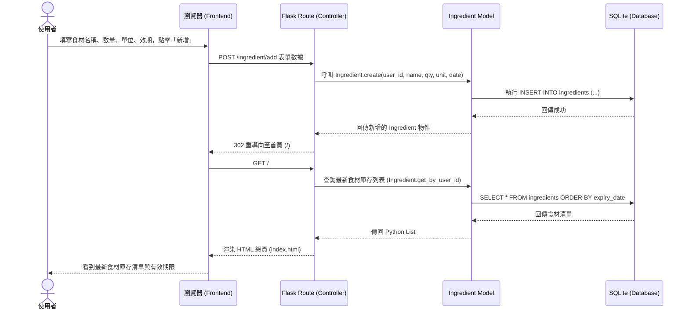
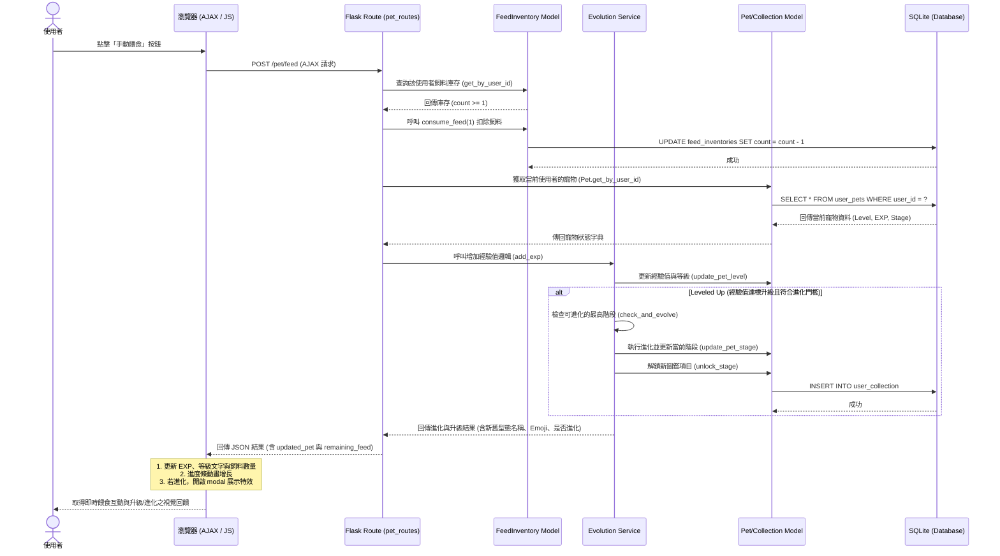
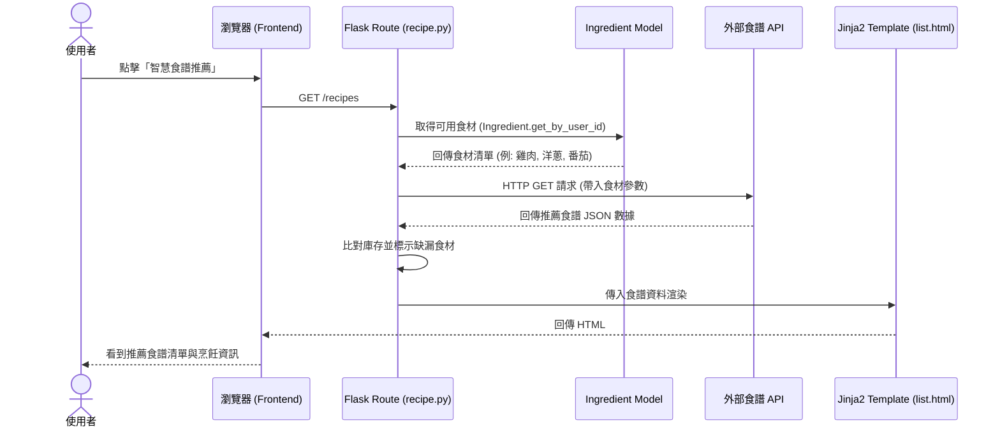
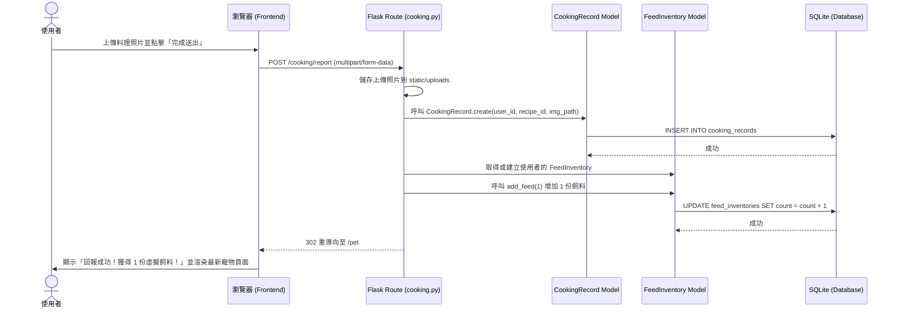

# 隨「食」隨地 — 系統流程圖 (Flowchart)

本文件基於 `docs/PRD.md` 與 `docs/ARCHITECTURE.md`，描繪「隨食隨地」系統的核心使用者旅程（User Journey）與系統運作流程，涵蓋食材管理、食譜推薦、虛擬寵物養成、進化圖鑑與烹飪回報。

---

## 1. 全域使用者流程圖 (User Flow)

描述使用者進入網站後，可以在各功能模組之間導覽與操作的完整路徑：

---

## 2. 核心系統資料流程圖

此流程圖涵蓋 MVP 階段四大核心功能的系統邏輯：

---

## 3. 系統序列圖 (Sequence Diagrams)

### 3.1 食材管理功能 (F-01) — 手動新增食材

### 3.2 寵物養成與進化功能 (F-03/F-06) — 餵食與進化判定

### 3.3 智慧食譜推薦功能 (F-02)

### 3.4 烹飪回報與飼料發放 (F-04)

---

## 4. 功能清單與頁面對照表

| 功能編號 | 功能名稱 | HTTP 方法 | URL 路徑 | 渲染模板 / 回傳格式 | 說明 |
| :--- | :--- | :---: | :--- | :--- | :--- |
| **F-01** | 我的材料庫首頁 | `GET` | `/` | `ingredients/index.html` | 列出目前所有食材與新增食材表單 |
| **F-01** | 新增食材 | `POST` | `/ingredient/add` | 重導向至 `/` | 接收新增食材表單，寫入庫存後導回 |
| **F-01** | 編輯食材頁面 | `GET` | `/ingredient/edit/<id>` | `ingredients/edit.html` | 呈現單一食材修改表單 |
| **F-01** | 更新食材 | `POST` | `/ingredient/update/<id>`| 重導向至 `/` | 接收編輯欄位更新庫存後導回 |
| **F-01** | 刪除食材 | `POST` | `/ingredient/delete/<id>`| 重導向至 `/` | 刪除指定食材後導回 |
| **F-02** | 推薦食譜 | `GET` | `/recipes/recommend` | `recipes/recommend.html` | 根據現有材料推薦合適食譜 |
| **F-03** | 虛擬寵物首頁 | `GET` | `/pet` | `pet/index.html` | 呈現寵物數據、等級、餵食與進化觸發 |
| **F-03** | 手動餵食互動 | `POST` | `/pet/feed` | JSON | 檢查飼料庫存並扣除，加經驗值升級進化並回傳 |
| **F-04** | 烹飪回報頁面 | `GET` | `/cooking` | `cooking/index.html` | 顯示烹飪回報表單 |
| **F-04** | 提交烹飪紀錄 | `POST` | `/cooking/report` | 重導向至 `/pet` | 接收照片、新增紀錄、發放 1 份飼料 |
| **F-06** | 圖鑑主頁面 | `GET` | `/collection` | `collection/index.html` | 顯示所有寵物圖鑑與解鎖進度 |
| **F-06** | 型態詳情頁面 | `GET` | `/collection/<id>` | `collection/detail.html` | 查看單一進化階段型態之風味說明與關係圖 |

---

## 5. 流程設計亮點說明

1. **閉環機制 (Closed Loop)**：使用者從「管理食材」出發，透過「食譜推薦」消化食材，再經由「烹飪回報」獲取獎勵（虛擬飼料），最後至「寵物頁面」消耗獎勵獲得成就感。當飼料不足時，又會引導使用者回到食譜頁面，形成高黏著度的正向循環。
2. **進化圖鑑解鎖 (F-06)**：每當寵物達到進化等級門檻，除了寵物外觀改變外，圖鑑中對應的型態也會自動解鎖，提供使用者收集與探索的動力。
3. **防呆與引導**：在寵物頁面中，若虛擬飼料庫存不足，系統不會只顯示錯誤，而是設計明確的 CTA (Call To Action) 引導使用者去「做菜收集飼料」。
4. **無縫的使用者體驗**：在「餵食」流程中採用 AJAX 異步請求，讓前端特效（如 `+EXP` 動畫、進食動畫、進化 Modal）不會因為頁面重整而中斷。
