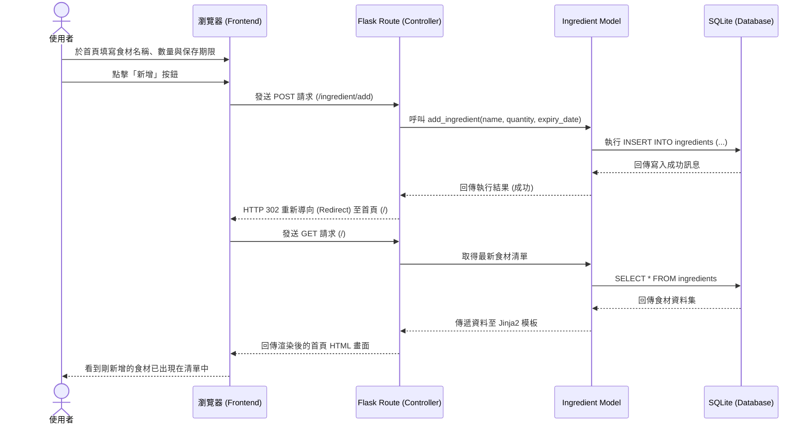

# 流程圖文件 (Flowchart) - 隨食隨地

本文件根據產品需求文件 (PRD) 與系統架構文件 (ARCHITECTURE) 繪製，旨在視覺化使用者的操作路徑與系統內部的資料流動，重點聚焦於 MVP 階段的核心功能「F-01: 食材輸入、辨識與管理」。

## 1. 使用者流程圖（User Flow）

以下流程圖展示了使用者進入「隨食隨地」系統後，如何與「我的材料庫」進行互動，包含新增、修改與刪除食材的操作路徑。

```mermaid
flowchart LR
    A([使用者開啟網站]) --> B[首頁 - 我的材料庫清單]
    
    B --> C{選擇要執行的操作？}
    
    C -->|新增食材| D[填寫新增食材表單]
    D -->|點擊送出| E[系統處理並儲存]
    E --> B
    
    C -->|修改食材數量| F[點擊編輯按鈕]
    F --> G[更新食材數量]
    G -->|點擊儲存| E
    
    C -->|刪除食材| H[點擊刪除按鈕]
    H --> I[確認刪除視窗]
    I -->|點擊確認| J[系統執行刪除]
    J --> B
    
    C -->|找靈感| K[點擊推薦食譜 (F-02)]
    K --> L[查看食譜頁面]
    L --> B
```

## 2. 系統序列圖（Sequence Diagram）

以下序列圖以「使用者手動新增食材」為例，展示了前端瀏覽器、後端 Flask 路由、資料庫模型與 SQLite 之間完整的資料流動過程。



## 3. 功能清單與 API 路由對照表

以下表格對應了 MVP 階段所需的核心操作、對應的 URL 路徑以及 HTTP 方法。

| 功能 ID | 功能名稱 | 使用者行為 | URL 路徑 | HTTP 方法 | 說明 |
| :--- | :--- | :--- | :--- | :--- | :--- |
| **F-01** | 查看材料庫 | 瀏覽首頁 | `/` 或 `/ingredients` | GET | 取得並顯示所有目前擁有的食材清單 |
| **F-01** | 新增食材 | 送出新增表單 | `/ingredient/add` | POST | 接收表單資料寫入資料庫，完成後導回首頁 |
| **F-01** | 修改食材數量 | 送出編輯表單 | `/ingredient/edit/<id>` | POST | 更新特定 ID 的食材數量，完成後導回首頁 |
| **F-01** | 刪除食材 | 點擊刪除按鈕 | `/ingredient/delete/<id>` | POST | 刪除特定 ID 的食材紀錄，完成後導回首頁 |
| **F-02** | 智慧食譜推薦 | 點擊推薦按鈕 | `/recipes/recommend` | GET | 根據目前擁有的食材，列出推薦食譜 (初期可能為假資料或基本邏輯) |

> 註：雖然標準 RESTful API 中刪除通常使用 `DELETE` 方法，修改使用 `PUT`/`PATCH`，但在純 HTML 表單中預設僅支援 `GET` 與 `POST`。為降低 MVP 實作複雜度，暫統一採用 `POST` 來處理新增、修改與刪除的狀態變更請求。
